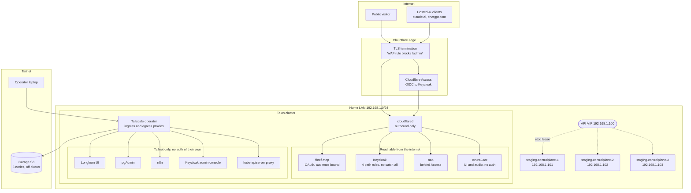
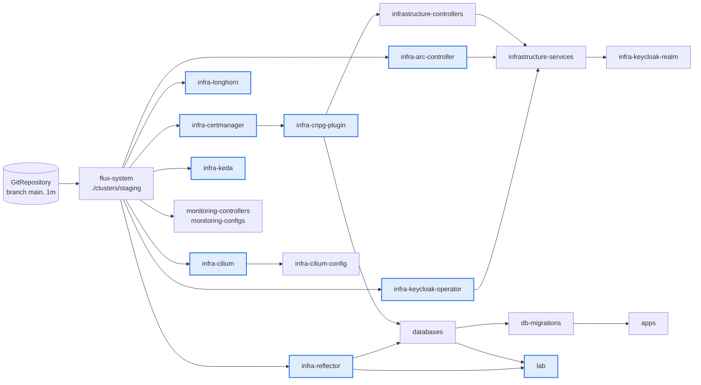
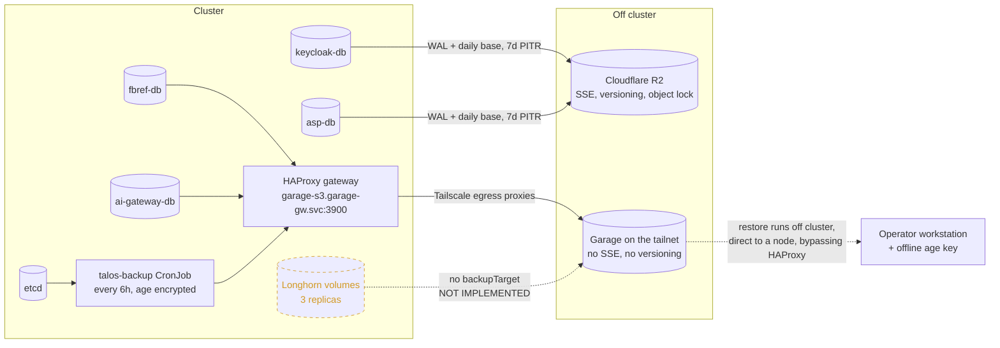

# Homelab: a three node bare metal Kubernetes cluster, run entirely as GitOps

A production shaped Kubernetes platform running on three bare metal machines in my
home, built and operated by one person over about six months and roughly 350 commits.
Nothing is applied by hand. Every workload, every operator, every alert rule and every
secret lives in this repository, and Flux reconciles the cluster towards it.

The interesting part of this project is not the list of components. It is the set of
decisions behind them, the incidents that forced those decisions, and the things I can
prove work because I restored them rather than because I configured them.

| | |
|---|---|
| **Nodes** | 3 bare metal boxes, `192.168.1.101` to `.103`, all control planes, all schedulable |
| **OS** | Talos Linux `v1.13.4`, immutable, no SSH, no package manager, API driven |
| **Kubernetes** | `v1.36.1`, API VIP `192.168.1.100` elected through an etcd lease |
| **GitOps** | Flux `v2.8.8`, 18 Kustomizations with an explicit dependency graph, `prune: true` everywhere |
| **Network** | Cilium `1.19.4` without kube-proxy, LB-IPAM pool `.110` to `.130`, Gateway API `v1.4.1` |
| **Storage** | Longhorn `1.12.0`, 3 replicas by default, one per node |
| **Databases** | 7 CloudNativePG Postgres clusters, 4 with continuous WAL shipped off cluster |
| **Secrets** | SOPS with age, 42 encrypted files, private key never committed |
| **Public surface** | 4 hostnames through a Cloudflare Tunnel. No inbound port is open on the router |
| **Admin surface** | Tailscale only. No admin console is reachable from the LAN or the internet |

Migrated from a single node k3s VM in June 2026. The repository name is historical.

---

## Contents

1. [Architecture](#architecture)
2. [The stack, and why each piece](#the-stack-and-why-each-piece)
3. [How the cluster is operated](#how-the-cluster-is-operated)
4. [Data, backups and disaster recovery](#data-backups-and-disaster-recovery)
5. [Three incidents that shaped the design](#three-incidents-that-shaped-the-design)
6. [What is measured, not assumed](#what-is-measured-not-assumed)
7. [Known limitations](#known-limitations)
8. [Repository layout](#repository-layout)
9. [Documentation index](#documentation-index)

---

## Architecture

The cluster has exactly two doors to the outside world, and they authenticate
differently. Everything that a browser can reach from the internet goes through a
Cloudflare Tunnel that dials outward, so no port is forwarded on the home router.
Everything administrative goes through Tailscale, where the tailnet identity is the
authentication.



Three properties of that picture are deliberate:

**The API VIP is not a daemon.** Talos elects it through an etcd lease. The winner adds
`.100` to its NIC and broadcasts a gratuitous ARP. If it dies, another node claims the
address within seconds and clients see one connection retry. No keepalived to run on an
immutable OS.

**The Talos API is deliberately not behind that VIP.** `talosctl` always targets real
node addresses, because the VIP depends on etcd and the recovery tool must keep working
when etcd is the thing that is broken. Total quorum loss means the VIP disappears and
`kubectl` dies while `talosctl` stays alive. That is the design, not an accident, and it
is what made the incident in [section 5](#three-incidents-that-shaped-the-design)
recoverable.

**All three nodes are control planes and all three run workloads.** With three machines,
any split into dedicated control planes and dedicated workers either loses quorum
survivability or loses capacity. The cost is real and named in
[the limitations](#known-limitations): etcd and application workloads share the same
three boxes with no isolation between them.

Details: [documentations/07-talos-ha-expansion.md](documentations/07-talos-ha-expansion.md),
[documentations/08-cilium-cni-ingress-migration.md](documentations/08-cilium-cni-ingress-migration.md).

---

## The stack, and why each piece

| Layer | Choice | Version | Why this one | What it replaced |
|---|---|---|---|---|
| Host OS | Talos Linux | `v1.13.4` | No SSH and no shell means the machine config is the only way to change a node, so node state is as reviewable as application state | Debian on Proxmox |
| Kubernetes | upstream via Talos | `v1.36.1` | Three member etcd survives one node leaving | single node k3s |
| Node config | talhelper | rendered | One `talconfig.yaml` renders all three machine configs, so the shared block cannot drift between nodes | three hand copied 25 KB files |
| CNI | Cilium | `1.19.4` | eBPF service load balancing lets kube-proxy be removed entirely; Hubble gives flow visibility | Flannel plus kube-proxy |
| Load balancer | Cilium LB-IPAM plus L2 announcements | in chart | Bare metal `type: LoadBalancer` with no extra controller | k3s ServiceLB, which does not exist on Talos |
| L7 ingress | Gateway API | `v1.4.1` | The chart already provides a GatewayClass; no second ingress controller to own | Traefik, retired with k3s |
| Storage | Longhorn | `1.12.0` | Replicated block storage across three nodes with online volume expansion | `local-path`, single node only |
| Databases | CloudNativePG plus the barman-cloud plugin | operator `0.28.2` | The operator owns failover, and the plugin is the path upstream is moving to | in tree `barmanObjectStore`, deprecated |
| Object storage | Cloudflare R2 and self hosted Garage | | R2 gives versioning and object lock; Garage gives capacity I own for the large datasets | |
| Identity | Keycloak on the official operator | operator `26.7.0` | OAuth 2.1 with dynamic client registration, which hosted AI clients require | a hand written StatefulSet |
| Certificates | cert-manager | `v1.16.2` | Issues one private namespaced CA for a single internal hop | |
| CI | Actions Runner Controller plus Nexus | ARC `0.14.2` | Ephemeral one job per pod runners, plus a local proxy cache for PyPI, Docker Hub and GHCR | GitHub hosted runners |
| Observability | kube-prometheus-stack | `66.2.2` | 10 hand written alert rules on top of the defaults, all routed to Telegram | |
| Secrets | SOPS with age | | Only the values are ciphertext, so manifests stay reviewable in a diff | |
| Automation | Renovate, self hosted | hourly | Keeps every pinned chart current inside the cluster | hosted GitHub App |

Every version above is pinned in a manifest in this repository. Chart bumps arrive as
Renovate pull requests.

---

## How the cluster is operated

There is one rule: **never `kubectl apply` a resource by hand.** Change the YAML, commit,
push, and Flux converges. The two documented exceptions are recorded as exceptions, with
their reasons, in [documentations/08](documentations/08-cilium-cni-ingress-migration.md#10-incident--recovery-2026-06-12)
and [documentations/13](documentations/13-azuracast-load-test.md).

The interesting part is the ordering. Flux applies a Kustomization atomically, so a
custom resource that shares a Kustomization with its own CRD deadlocks on
`no matches for kind`. The graph below is what solves that: narrow operator tiers carry
`wait: true` plus a health check, and everything that needs them declares `dependsOn`.



Blue nodes are hard gates: `wait: true` plus a health check, so nothing downstream is
applied until the operator is genuinely Ready.

A few things worth pointing at:

- **Two reconcile cadences.** Operator tiers run at `interval: 1h` because they only
  change when a human bumps a chart. Application and service tiers run at `1m0s`.
- **`force: true` on exactly two Kustomizations.** A Job is immutable, so a schema
  migration or a Keycloak realm import can only be reapplied by delete and recreate.
- **`prune: true` on all of them.** Deleting a file deletes the object. This is the
  behaviour that makes git the actual source of truth, and it is also why the missing
  render check listed in [the limitations](#known-limitations) matters.
- **Secrets decrypt in cluster.** Seven Kustomizations carry a `decryption` block
  pointing at a `sops-age` Secret that is created by hand, once per cluster, and never
  committed. A path that gains its first encrypted Secret without that block fails
  silently: Flux applies the literal `ENC[AES256_GCM,...]` string and nothing errors. That
  failure happened, and the fix is documented inline at
  `clusters/staging/infrastructure.yaml:282`.

Reference: [documentations/00-bootstrap-cluster.md](documentations/00-bootstrap-cluster.md),
[documentations/01-architecture.md](documentations/01-architecture.md).

---

## Data, backups and disaster recovery

Two independent pipelines ship state off the cluster, and the restore path deliberately
does not retrace the write path.



What that buys, stated honestly:

- **7 Postgres clusters, 4 with continuous WAL archiving** and a daily base backup, seven
  day point in time recovery. Two go to R2, two to self hosted Garage.
- **etcd every 6 hours**, age encrypted, using a Talos API role scoped to exactly one
  method (`os:etcd:backup`) rather than a static long lived credential. Worst case RPO for
  control plane state is 6 hours.
- **The etcd age private key is offline and is not in this repository**, not even SOPS
  encrypted, specifically so that losing the SOPS key does not also lose the snapshots.
- **A restore drill was actually run.** On 2026-07-26 `fbref-db` was rebuilt from Garage
  into a throwaway cluster and reached healthy in about 2.5 minutes, 3488 MB, matching the
  source exactly at roughly 9.7M rows in the largest table. A backup you have never
  restored is a hypothesis.
- **The dashed edges are the gaps, and they are drawn on purpose.** Longhorn has no
  `backupTarget`, so replicas protect against one node dying and nothing else. The final
  step of the etcd drill, decrypting a real stored object with the offline key, is still
  outstanding.

Detail: [documentations/03-backups.md](documentations/03-backups.md),
[documentations/09-etcd-backup-dr.md](documentations/09-etcd-backup-dr.md),
[documentations/12-garage-object-storage.md](documentations/12-garage-object-storage.md).

---

## Three incidents that shaped the design

These are the parts of the project I would want to be asked about.

### 1. The CNI cutover deadlocked the cluster, and the fix was in a repository Flux could no longer read

**2026-06-12.** Swapping Flannel plus kube-proxy for Cilium on the live cluster, I pushed
the Flux manifests before applying the Talos machine config. Flux auto reconciles on push,
so Cilium installed while the Gateway API CRDs did not exist yet and while kube-proxy was
still running. Service VIPs went unprogrammed, CoreDNS at `10.96.0.10:53` started
refusing connections, every Flux controller entered CrashLoopBackOff, and
source-controller could no longer fetch git. The corrective commit existed. Nothing in the
cluster could reach it.

The control plane survived because it is host network and does not depend on the CNI. The
recovery was a deliberate, documented violation of this repository's own rule: patch the
`cilium-config` ConfigMap by hand to point the agents at KubePrism on `localhost:7445`,
which is host network and always up, restart the DaemonSet, then apply the Talos config
with `talosctl` (which also does not need cluster DNS), then reboot one node at a time
starting with the node hosting Flux and CoreDNS. Flux later reapplied the identical value
from git, so there was no drift.

**What changed structurally:** ordering became an explicit gate in the runbook. Apply the
platform prerequisites first, or push with the Kustomization suspended. And keep a control
path that never depends on the thing you are replacing.

[Full postmortem](documentations/08-cilium-cni-ingress-migration.md#10-incident--recovery-2026-06-12)

### 2. One unset environment variable took the AI gateway down for two days while every dashboard said backups were fine

**2026-08-10.** Bifrost was in CrashLoopBackOff with 187 restarts, failing to reach its
database. The database was not the problem. Five hops back: barman-cloud set no AWS
region, so boto3 signed requests as `us-east-1` while Garage runs with region `garage`.
Only `HeadBucket` enforces the region. `GetObject`, `PutObject` and `ListObjectsV2` all
tolerate the mismatch. So `barman-cloud-check-wal-archive` failed with HTTP 400 on its
very first call, continuous archiving was false from minute one, and base backups kept
succeeding the whole time so `LastBackupSucceeded` stayed true. Postgres cannot recycle an
unarchived WAL segment, `pg_wal` grew to 9.94 GiB of a 10 GiB volume, CNPG shut the primary
down on low disk, the replica could not be promoted because it wanted a segment that only
existed on the dead primary, and the read/write Service lost its only endpoint.

**What changed structurally:** the region is now set on every Garage object store, the
volume was given headroom so Postgres can start with a broken archive and drain the
backlog, and the alerting was rewritten. The first attempt measured seconds since last
archival, which false positives on a quiet database (`asp-db` sat 47 hours past its last
archive with nothing wrong) and misses the real signal. The rule now measures the backlog
itself, `pg_wal_archive_status{value="ready"} > 0`, because every `.ready` file is a
segment Postgres may not recycle. During the outage the failing instance reported 119
waiting and every other instance reported 0.

The worst property of this bug is that it is invisible on every established cluster and
fatal on every new one, because `HeadBucket` only runs while the archive is empty.

[Full postmortem](documentations/12-garage-object-storage.md#postmortem--2026-08-10-ai-gateway-down-for-2-days)

### 3. Longhorn declared healthy data faulted on all three nodes, because of a config file

Every node reinstall produced the same thing: volumes detached and faulted, the Longhorn
node resource raising `DiskFilesystemChanged`, and manager logs reading
`Bringing up 0 replicas for auto-salvage`. A storm boot had regenerated
`/var/lib/longhorn/longhorn-disk.cfg` with a fresh UUID while the node resource and every
replica still held the old one. The node resource survives even Kubernetes node deletion,
so the mismatch outlives a rebuild. The bytes were intact the entire time. Only the
identity of the disk had changed. Writing the original UUID back and waiting about 30
seconds let auto salvage revive the replicas on its own.

**The lesson I keep:** "faulted" from a storage controller is a claim about metadata
agreement, not necessarily about bytes. Check whether the controller has simply lost
track of a disk it can still read before doing anything destructive.

[Troubleshooting log](documentations/07-talos-ha-expansion.md#troubleshooting-hit-during-phases-13-2026-06-11)

More of these, including salvaging a Postgres base backup whose WAL chain was gone with
`pg_resetwal` in a scratch pod (29.7k rows recovered), a Nexus blob store that filled a
volume to 99% with data it had already deleted, and an etcd member stuck as a learner
forever, are in [documentations/14-design-decisions.md](documentations/14-design-decisions.md).

---

## What is measured, not assumed

Capacity claims in this repository come from a measurement rig, not from a datasheet.

The AzuraCast station was swept from 0 to 1000 concurrent listeners in 8 steps, each with
a 120 second settle and a 180 second Prometheus window:

| Listeners | CPU | RAM | Egress |
|---|---|---|---|
| 0 (idle) | 0.130 cores | 656 MiB | ~0 |
| 1000 | 0.210 cores | 668.3 MiB | 24 682 KiB/s (202 Mbps) |
| **marginal cost per listener** | **0.086 millicores** | **12 KiB** | **24.7 KiB/s (0.202 Mbps)** |

The workload is bandwidth bound and nothing else: 1000 listeners cost 0.09 of a CPU core.
The ceiling is the NIC, roughly 4000 listeners at a sane 80% of 1 Gbps.

Two things make that dataset trustworthy, and both were bugs caught before they produced
confident wrong numbers:

- The measured 24.7 KiB/s per listener sits about 3% above the 24 KiB/s theoretical cost
  of a 192 kbps mount. Deciding that sanity anchor **before** running is what made a broken
  run look broken instead of plausible.
- Listener count is read from Icecast's own socket count, never from the application API,
  which is a periodically rebuilt cache that reported 2 listeners while Icecast reported 1.
  And the load generators run with requests only, because a CPU limit would throttle the
  readers and drag measured egress below the real cost.

A follow up sweep over the real internet through two off site proxies produced a verdict
the design could not support, and the honest write up says so: one of the two remote sites
had been dead for three steps, so its reading was, in the document's words, a corpse
casting a vote. A single site attribution run showed the shared home uplink was not the
constraint. The conclusion was rewritten to state the bound actually proven, at least
16.6 Mbps or 80 concurrent listeners, with the true ceiling left explicitly unmeasured
because both remote endpoints were weaker than the thing being measured.

[documentations/13-azuracast-load-test.md](documentations/13-azuracast-load-test.md),
[documentations/11-azuracast-public-relay.md](documentations/11-azuracast-public-relay.md)

---

## Known limitations

Written down because a reviewer will find them anyway, and because most of them are
tracked work rather than blind spots.

**Single everything.** One site, one L2 segment, one router, one ISP, one operator, one
age key. Garage is off cluster but it is not off site. There is no second region and no
second pair of hands.

**No Longhorn backup target.** Three replicas protect against one node dying. They do not
protect against a correlated failure, and an etcd restore returns PersistentVolume objects
without their contents. Everything stateful that has no database backup of its own (GLPI,
AzuraCast, audiobookshelf, linkding, Nexus, n8n's own volume) is lost in a full cluster
rebuild. This is the next piece of work.

**No CI on this repository.** There is no render check, no `kubeconform`, no lint and no
SOPS leak check on a pull request. The verification commands exist but a human has to run
them, which is a convention rather than a control. This is conspicuous in a repository
that operates an entire self hosted Actions runner fleet for a different repository.

**Staging only.** `clusters/production` and the production overlays exist and are wired,
but no production cluster is deployed and the tree has not been touched since June 2026.
Treat it as scaffolding.

**The etcd restore has never been completed end to end.** Tiers 0 and 1 of the drill are
scripted, proven and repeatable via `mise run etcd-drill`. Tier 2, the destructive full
rehearsal, is deliberately manual and has not been run.

**Cilium is used as a datapath, not as a policy engine.** There are five NetworkPolicy
objects in the whole repository and no default deny anywhere. Choosing an eBPF policy
engine and then not writing policy is a real gap.

**Some control planes live outside git.** The Cloudflare Tunnel routes, the WAF rule, the
Access policy and the Tailscale ACLs are all configured in vendor dashboards. The
repository carries a hand maintained README as the compensating control, and that control
has already failed once: it claimed a hostname served only a web UI when it was in fact
also serving a 24/7 audio stream. That was found by checking from outside, and the record
was corrected.

**Workload level HA is thinner than platform level HA.** There is one PodDisruptionBudget
in the repository. The thesis is that any node can be unplugged; the workload tier does not
yet enforce it.

---

## Repository layout

```
bootstraping/        Talos layer. talconfig.yaml renders all three machine configs
clusters/staging/    Flux entrypoints: the Kustomizations and their dependency graph
infrastructure/
  controllers/       Operators: cilium, cert-manager, cnpg, longhorn, arc, keda, keycloak
  services/          Platform workloads: nexus, cloudflare, garage-gateway, etcd-backup
apps/                Application tier
monitoring/          kube-prometheus-stack, PrometheusRules, Grafana dashboards as code
documentations/      Numbered guides. Start at 14 for the decisions, 01 for the layout
scripts/             Helper scripts, including the read only etcd restore drill
```

Every tier uses a `base/` plus `staging/` (plus `production/`) kustomize overlay pair.

The developer environment is a devcontainer with a `mise.toml` toolchain, so the whole
tool set (`talosctl`, `talhelper`, `flux`, `sops`, `age`, `helm`, `kubectl`) comes up with
one command.

**Verifying a change before it is committed:**

```bash
kubectl kustomize infrastructure/services/staging   # render check
flux get kustomizations
flux get helmreleases -A
```

---

## Documentation index

Every one of these was written while doing the work, not afterwards. The troubleshooting
sections are the parts worth reading.

| # | Document | What it covers |
|---|---|---|
| 14 | [Design decisions and tradeoffs](documentations/14-design-decisions.md) | **Start here.** Every significant decision, what was rejected, and what it cost |
| 00 | [Bootstrap the cluster](documentations/00-bootstrap-cluster.md) | Talos install, SOPS key, Flux bootstrap, second cluster |
| 01 | [Architecture](documentations/01-architecture.md) | Repository layout and the Flux reconcile graph |
| 02 | [Keycloak](documentations/02-keycloak.md) | Identity, the `mcp` realm, dynamic client registration, admin console hardening |
| 03 | [Database backups](documentations/03-backups.md) | CNPG to R2 and Garage, PITR, the restore drill |
| 04 | [CI runners and cache](documentations/04-ci-runners-cache.md) | ARC, the manual dind template, Nexus, the JDK 25 blob store incident |
| 05 | [Alerting](documentations/05-alerting.md) | Two independent Telegram paths and why both exist |
| 06 | [Retiring k3s](documentations/06-k3s-retirement.md) | The migration, in dependency order, with one cluster running at a time |
| 07 | [Talos HA expansion](documentations/07-talos-ha-expansion.md) | 1 node to 3, the VIP, Longhorn to 3 replicas, the storage reserve |
| 08 | [Cilium CNI and ingress](documentations/08-cilium-cni-ingress-migration.md) | The live CNI swap, and the incident it caused |
| 09 | [etcd backup and DR](documentations/09-etcd-backup-dr.md) | Snapshots, the offline key, and a three tier restore drill |
| 10 | [n8n automation](documentations/10-n8n-automation.md) | The automation host, its egress constraint, and what is deliberately not alerted |
| 11 | [AzuraCast public relay](documentations/11-azuracast-public-relay.md) | Measuring a home uplink over the real internet, and a wrong verdict corrected |
| 12 | [Garage object storage](documentations/12-garage-object-storage.md) | Self hosted S3, and the postmortem of the outage it caused |
| 13 | [AzuraCast load test](documentations/13-azuracast-load-test.md) | What a listener actually costs, and the two measurement traps avoided |
