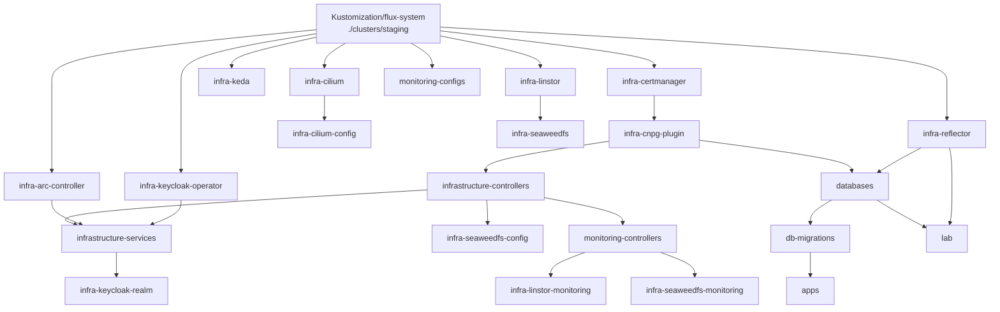

# clusters/ — Flux entrypoints

## What this is

`clusters/<name>/` is the only directory Flux reads directly. Everything else in the
repository (`infrastructure/`, `apps/`, `monitoring/`) is inert YAML until a
`kustomize.toolkit.fluxcd.io/v1` Kustomization here points a `path:` at it.

`staging` is the live cluster. `production` is scaffolding: the files exist and are
internally consistent, but no production cluster is deployed.

The files in `clusters/staging/` declare 22 Flux Kustomizations, 4 `GitRepository`
sources for the application Helm charts, and the flux-generated bootstrap manifests.
They carry no workload YAML of their own — only ordering, gating, timeouts and
decryption.

## How it is wired, file by file

### `staging/flux-system/`

Generated by `flux bootstrap` / `flux install`. Both `gotk-components.yaml` and
`gotk-sync.yaml` carry a `DO NOT EDIT` header — regenerate them with the flux CLI
rather than hand-editing.

- `gotk-components.yaml` — Flux `v2.8.8`, components
  `source-controller,kustomize-controller,helm-controller,notification-controller`.
- `gotk-sync.yaml` — the root pair:
  - `GitRepository/flux-system` → `ssh://git@github.com/eliorion/homelab_v1`, branch
    `main`, `interval: 1m0s`, `secretRef: flux-system`.
  - `Kustomization/flux-system` → `path: ./clusters/staging`, `interval: 10m0s`,
    `prune: true`. It has **no** `decryption` block, which is why the bootstrap
    secrets are created out of band (see Traps).
- `kustomization.yaml` — lists the two files above. Nothing else.

Every other Kustomization in this directory names `sourceRef: GitRepository/flux-system`,
so the whole tree reconciles from one clone.

### `staging/infrastructure.yaml` — 16 Kustomizations

| name | path (`./`-relative to repo root) | interval | timeout | dependsOn | gate |
| --- | --- | --- | --- | --- | --- |
| `infra-certmanager` | `infrastructure/controllers/base/cert-manager` | 1h | 5m | — | wait + Deployments `cert-manager`, `cert-manager-webhook` (ns `cert-manager`) |
| `infra-cnpg-plugin` | `infrastructure/controllers/base/cnpg/plugin` | 1h | 10m | `infra-certmanager` | wait + HelmRelease `plugin-barman-cloud` |
| `infra-arc-controller` | `infrastructure/controllers/base/arc` | 1h | 5m | — | wait + Deployment `arc-controller-gha-rs-controller` (ns `arc-system`) |
| `infra-cilium` | `infrastructure/controllers/base/cilium` | 1h | 10m | — | wait + HelmRelease `cilium` |
| `infra-cilium-config` | `infrastructure/controllers/base/cilium/config` | 1h | 5m | `infra-cilium` | — |
| `infra-keda` | `infrastructure/controllers/base/keda` | 1h | 10m | — | wait + Deployment `keda-operator` (ns `keda`) |
| `infra-reflector` | `infrastructure/controllers/staging/reflector` | 1h | 5m | — | wait + Deployment `reflector` (ns `reflector`), sops |
| `infra-keycloak-operator` | `infrastructure/controllers/base/keycloak-operator` | 1h | 5m | — | wait + Deployment `keycloak-operator` (ns `identity`) |
| `infrastructure-controllers` | `infrastructure/controllers/staging` | 1m0s | 5m | `infra-cnpg-plugin` | sops |
| `infrastructure-services` | `infrastructure/services/staging` | 1m0s | 5m | `infrastructure-controllers`, `infra-arc-controller`, `infra-keycloak-operator` | sops |
| `infra-keycloak-realm` | `infrastructure/services/staging/keycloak/realm` | 1h | 10m | `infrastructure-services` | force + wait, sops |
| `infra-linstor` | `infrastructure/controllers/base/linstor` | 1h | 15m | — | wait + HelmRelease `piraeus-operator` |
| `infra-seaweedfs` | `infrastructure/controllers/base/seaweedfs` | 1h | 15m | `infra-linstor` | wait + HelmRelease `seaweedfs-csi-driver` |
| `infra-seaweedfs-config` | `infrastructure/controllers/staging/seaweedfs-config` | 1h | 15m | `infrastructure-controllers` | force |
| `infra-linstor-monitoring` | `infrastructure/controllers/base/linstor/monitoring` | 1h | 5m | `monitoring-controllers` | — |
| `infra-seaweedfs-monitoring` | `infrastructure/controllers/base/seaweedfs/monitoring` | 1h | 5m | `monitoring-controllers` | — |

The HelmRelease health checks target namespace `flux-system` because that is where the
HelmRelease objects live, not where the chart installs.

Why the operator tiers are split out of `infrastructure-controllers` instead of being
resources inside it:

- **`infra-certmanager` first.** The CNPG barman-cloud plugin needs cert-manager's
  CRDs and a working webhook to issue its own certificates, so `infra-cnpg-plugin`
  depends on it rather than racing it.
- **`infra-cnpg-plugin` gates `infrastructure-controllers`** so the CNPG operator and
  the plugin are Ready before any `Cluster` object is applied.
- **`infrastructure-services` depends on `infrastructure-controllers`** because the
  services tier ships CNPG `Cluster` objects of its own —
  `infrastructure/services/staging/databases` lists `keycloak/` (Keycloak's database),
  `ai-gateway/` and `dbtools/` — and the CNPG operator that reconciles them is in
  `infrastructure/controllers/staging`.
- **`infra-arc-controller` is separate** because `arc-runner-set` inside
  `infrastructure-services` is a HelmRelease of `AutoscalingRunnerSet` CRs — applying
  them against unregistered CRDs is a reconcile error, not a wait.
- **`infra-cilium-config` is separate from `infra-cilium`** because the pool and
  Gateway objects under `.../cilium/config` need the `CiliumLoadBalancerIPPool` and
  Gateway API CRDs that the chart itself installs.
- **`infra-keycloak-operator` is separate from `infrastructure-services`** for the same
  CRD reason, and because the `identity` namespace ships with the operator manifests.
  The Keycloak CR in `infrastructure-services` cannot be applied before both exist.
- **`infra-keycloak-realm` runs last**, after `infrastructure-services`, because the
  keycloak-config-cli Job authenticates with the `keycloak-initial-admin` Secret that
  the operator generates once Keycloak is up.
- The longer timeouts (`infra-longhorn` 15m, `infra-cilium` 10m, `infra-keda` 10m)
  exist because a first install on a cold node pulls the full image set before the
  health check can pass.

### `staging/apps.yaml` — 3 Kustomizations

The release ordering is databases → migrations → applications:

| name | path | interval | timeout | dependsOn | flags |
| --- | --- | --- | --- | --- | --- |
| `databases` | `apps/staging/databases` | 1m0s | 5m | `infra-cnpg-plugin`, `infra-reflector` | wait, sops |
| `db-migrations` | `apps/staging/databases/db-migrations` | 1m0s | 5m | `databases` | force, wait |
| `apps` | `apps/staging` | 1m0s | 5m | `db-migrations` | sops |

- `databases` brings up the CNPG clusters and their secrets. `apps/staging/databases`
  currently lists `asp/`, `fbref/`, `n8n/` and `scraper/`. `wait: true` means Ready
  only once the CNPG `Cluster` objects report Ready.
- `db-migrations` runs the Flyway Jobs (`asp/`, `fbref/`, `scraper/`). It depends on
  `databases` because each Job reads its connection details from the CNPG-generated
  `<name>-db-app` Secret and pulls its image with `ghcr-pull-secret` — neither exists
  until `databases` is Ready. `wait: true` makes the Kustomization Ready only when the
  Jobs **complete**; a failed Job is NotReady, which is what stops `apps` from rolling
  out.
- `apps` applies `apps/staging`, whose `kustomization.yaml` lists `asp/`,
  `audiobookshelf/`, `azuracast/`, `fbref/`, `glpi/`, `linkding/`, `n8n/`, `scraper/`.

The net effect on a release: running pods keep their previous image tags while the
migration Job runs, and the new tags only apply once the Job has completed.

Both `databases` and `lab` depend on `infra-reflector`, which gates the whole
application chain on the central `ghcr-pull-secret` having been mirrored — no namespace
pulls a private image before the copy exists. `infra-reflector` has `wait: true`, so
that gate is real rather than advisory.

### `staging/lab.yaml` — 1 Kustomization

`lab` → `apps/staging/lab`, `interval: 1m0s`, `timeout: 10m`, `wait: true`, health
check on HelmRelease `lab` in `flux-system`. Depends on `databases` (for the CNPG
`<db>-app` secrets and the reflector permit annotations set by the
`cluster-reflector-patch.yaml` files) and on `infra-reflector` (the controller that
fills the chart-generated `reflects` stubs in the `lab` namespace).

`apps/staging/lab` is `namespace.yaml` + `release.yaml`: the `lab` namespace and one
HelmRelease that renders one pod per project in its `projects` list, each reading its
project's read-only database replica. The labs are always on (`replicas: 1`), so a lab is
reachable on the tailnet without scaling it up first; the scale and port-forward commands
are in [`../apps/staging/lab/README.md`](../apps/staging/lab/README.md).

### `staging/monitoring.yaml` — 2 Kustomizations

| name | path | interval | timeout | dependsOn | flags |
| --- | --- | --- | --- | --- | --- |
| `monitoring-controllers` | `monitoring/controllers/staging` | 1m0s | 5m | — | sops |
| `monitoring-configs` | `monitoring/configs/staging` | 1m0s | 5m | — | sops |

`monitoring-controllers` is `kube-prometheus-stack`. `monitoring-configs` is
`kube-prometheus-stack`, `flux-alerts`, `flux-am`, `fbref-grafana`,
`etcd-backup-alerts`, `cnpg-alerts`, `n8n-metrics`.

Neither declares a `dependsOn`. They reconcile independently of the infrastructure
tier; the PrometheusRules and dashboards apply whether or not the objects they observe
exist yet.

### `staging/sources.yaml` — 4 GitRepositories

All four point at the same private repository and reuse one read-only deploy key
Secret, `asp-deploy-key`. `interval: 1m0s`, branch `main`, `secretRef: asp-deploy-key`.

| name | chart path in the source repo | url as written |
| --- | --- | --- |
| `asp` | `k8s/charts/asp` | `ssh://git@github.com/eliorion/asp` |
| `fbref` | `k8s/charts/fbref` | `ssh://git@github.com/Eliorion/asp` |
| `lab` | `k8s/charts/lab` | `ssh://git@github.com/eliorion/asp` |
| `scraper` | `k8s/charts/scraper` | `ssh://git@github.com/eliorion/asp` |

`lab` is the central in-cluster analysis sandbox. `scraper` is the API-only scraping
platform — engine lanes, backend, admin-ui and FlareSolverr — that `asp` and `fbref`
consume through their ingest deployments.

Each carries an `ignore:` block that excludes everything except its own chart
directory. That is not tidiness: the consuming HelmReleases
(`apps/staging/asp/release.yaml`, `fbref`, `lab`, `scraper`) use
`reconcileStrategy: Revision`, which upgrades on **every** new artifact revision. Widen
an `ignore:` block and unrelated application-code commits in the source repo start
triggering Helm upgrades. Keep it narrow and the upgrade fires exactly on chart and
image-tag commits, which is what makes the release path zero-touch: CI bumps the tag in
the chart's `values.yaml` — `images.fbref.tag` on every fbref release — the artifact
revision changes, the HelmRelease upgrades.

One-time manual setup for `asp-deploy-key` — the `flux-system` Kustomization has no
sops decryption, so this Secret is created out of band, same as the `flux-system` and
`sops-age` Secrets:

```bash
flux create secret git asp-deploy-key \
  --url=ssh://git@github.com/eliorion/asp
```

Then add the printed public key as a **read-only** deploy key on the source GitHub
repository (Settings → Deploy keys).

## The dependency graph



Nodes with no inbound edge have no `dependsOn` and are applied immediately by the root
Kustomization.

`infra-linstor-monitoring` and `infra-seaweedfs-monitoring` are the only two edges that
run backwards, from the monitoring tier into an infrastructure path. Their objects are a
`ServiceMonitor` and two `PrometheusRule`s that live with their components, but the CRDs
come from the `kube-prometheus-stack` chart — so they cannot sit inside `infra-linstor`
or `infra-seaweedfs`, which are `wait: true` and would go NotReady on a cold bootstrap
and block `monitoring-controllers` from ever installing those CRDs. Splitting them is the
same move `infra-cilium-config` makes for the Cilium CRs.

Two reconcile cadences: operator tiers run at `interval: 1h` because they only change
when a human bumps a chart version; application and service tiers run at `1m0s`.

## Traps

- **A path that gains its first sops Secret needs a `decryption:` block, and the
  failure is silent.** Without one, Flux applies the manifest verbatim, so the Secret's
  values are the literal `ENC[AES256_GCM,...]` ciphertext and nothing errors at apply
  time. This has happened twice:
  - `monitoring-controllers`, when `kube-prometheus-stack/grafana-admin.enc.yaml` was
    added — Grafana simply refused the admin login with no error anywhere in the chain.
  - `infra-keycloak-realm`, when `cloudflare-access-client.enc.yaml` was added — the
    config-cli Job substituted the ciphertext string into the realm's redirect URI and
    Keycloak rejected the client with
    `400 {"error":"invalid_input","error_description":"A redirect URI is not a valid URI"}`,
    which reads as a bad realm file rather than as a missing decryption block.

  Eight of the twenty-two Kustomizations carry the block: `infrastructure-controllers`,
  `infrastructure-services`, `infra-reflector`, `infra-keycloak-realm`, `databases`,
  `apps`, `monitoring-controllers`, `monitoring-configs`. All point at the same
  `sops-age` Secret, created by hand once per cluster and never committed.

- **`force: true` on exactly two Kustomizations, and both need it.** A Job is
  immutable. `db-migrations` cannot pick up an image-tag bump, and
  `infra-keycloak-realm` cannot pick up a realm edit (which changes the generated
  ConfigMap hash, which changes the Job spec), without a delete and recreate.

- **`timeout: 10m` on `infra-keycloak-realm` must stay above the Job's own wait.**
  `infrastructure/services/base/keycloak/realm/job.yaml` sets
  `KEYCLOAK_AVAILABILITYCHECK_TIMEOUT: 300s`; the Job spends up to five minutes waiting
  for Keycloak to come up before it does any work.

- **`timeout: 5m` on `db-migrations` must stay above `backoffLimit(3) × migration
  runtime`.** The Flyway Jobs under `apps/staging/databases/db-migrations/*/` are all
  `backoffLimit: 3`.

- **`prune: true` is set on every Kustomization here.** Deleting a file from the
  repository deletes the live object. This is what makes git the source of truth, and
  it is also why a render check before commit is not optional.

- **`apps/staging/kustomization.yaml` must not list `databases/` or `lab/`.** Separate
  Flux Kustomizations own those paths; adding them to the `apps` overlay would put two
  Kustomizations in charge of the same objects, and each would fight the other's
  `prune`.

- **`gotk-components.yaml` and `gotk-sync.yaml` are generated.** Hand edits are lost on
  the next `flux bootstrap`.

- **`staging/age.agekey` and `staging/.envrc` are gitignored** (`*.agekey`, `*.envrc` in
  `.gitignore`) and are not part of the reconciled tree. They are local operator material;
  do not commit them and do not reference them from a manifest.

## Operating it

```bash
flux get kustomizations                        # the 22 above, plus flux-system
flux get sources git                           # flux-system + asp, fbref, lab, scraper
flux get helmreleases -A

flux reconcile source git flux-system          # pull the latest commit now
flux reconcile kustomization infrastructure-services --with-source

kubectl kustomize infrastructure/services/staging   # render check before commit
kubectl kustomize apps/staging
```

A Kustomization stuck NotReady is usually one of three things: its `dependsOn` target
is NotReady, a `wait: true` health check never passed, or a sops Secret went in without
a `decryption:` block (see Traps).

Bootstrap and cluster-creation procedure:
[`../documentations/00-bootstrap-cluster.md`](../documentations/00-bootstrap-cluster.md).
Tier layout rationale:
[`../documentations/01-architecture.md`](../documentations/01-architecture.md).

## Overlays: staging vs production

`clusters/production/` mirrors the staging structure with a smaller graph and points at
the `production` overlays, which exist for `infrastructure/controllers`,
`infrastructure/services`, `apps` and `monitoring/controllers`. It differs from staging
in ways worth knowing before treating it as a template:

- No `sources.yaml` and no `lab.yaml`.
- `apps` depends only on `infra-cnpg-plugin`; there is no `databases` →
  `db-migrations` → `apps` chain and no reflector gate.
- `monitoring.yaml` declares only `monitoring-controllers`; there is no
  `monitoring-configs` and no `monitoring/configs/production` directory.
- Its `gotk-sync.yaml` Kustomization points at `./clusters/production`.

No production cluster is deployed. Treat the directory as scaffolding, not as a
reviewed second environment.

## Notes on this README

Prose that used to live as comments inside the manifests was moved here. Four claims
in it were stale and are corrected above rather than copied forward:

- `lab.yaml` said `databases` covers "asp/ + fbref/". That path now also lists `n8n/`
  and `scraper/`.
- `lab.yaml` said the labs are "off by default (replicas: 0)".
  `apps/staging/lab/release.yaml` sets `replicas: 1`.
- `infrastructure.yaml` said the reflector overlay mirrors `ghcr-pull-secret` into
  "asp/fbref/lab". The Secret's reflector annotations list `asp,fbref,lab,scraper`.
- `monitoring.yaml` carried a commented-out `dependsOn: - name: infra-configs` on both
  Kustomizations. No Kustomization named `infra-configs` exists anywhere in the
  repository; the commented block was removed and the actual behaviour (no dependency)
  is documented above.
