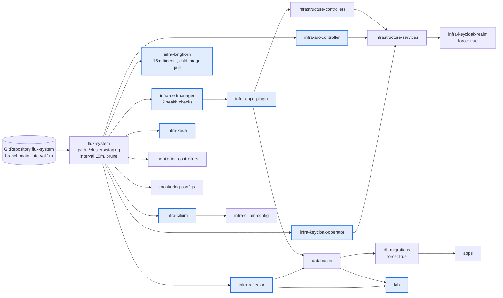

# Architecture: repository layout and the reconcile graph

How this repository is organised, and how Flux turns it into a running cluster.

The short version: `clusters/staging/` is the only entrypoint. Everything else in the
repository is inert YAML until a Kustomization in that directory points at it.

For the reasoning behind these choices, see
[14-design-decisions.md](14-design-decisions.md#8-gitops-and-developer-workflow).

## Tree

```
bootstraping/                Talos layer, applied with talosctl, not with Flux
  talconfig.yaml             single source of truth for all three machine configs
  talsecret.sops.yaml        the cluster PKI, encrypted, committed, never regenerated
  clusterconfig/             rendered per node configs (gitignored)

clusters/
  staging/                   the reconcile graph for the live cluster
    flux-system/             owned by Flux, do not edit
    sources.yaml             GitRepository objects for the external app charts
    infrastructure.yaml      12 Kustomizations, operators and platform services
    apps.yaml                databases, db-migrations, apps
    lab.yaml                 the lab tier
    monitoring.yaml          monitoring controllers and configs
  production/                wired but not deployed, see the note at the end

infrastructure/
  controllers/               operators: cilium, cert-manager, cnpg, longhorn,
    base/                    arc, keda, keycloak-operator, reflector, tailscale
    staging/
  services/                  platform workloads: nexus, cloudflare, garage-gateway,
    base/                    etcd-backup, keycloak, renovate, ai-gateway, radar
    staging/

apps/
  base/                      application manifests shared across environments
  staging/                   the environment overlay Flux actually reconciles
  production/

monitoring/
  controllers/               kube-prometheus-stack
  configs/staging/           PrometheusRules, PodMonitors, Grafana dashboards as code

documentations/              these files
scripts/                     helper scripts, including the etcd restore drill
```

Every tier follows the same `base/` plus overlay pattern: `base/` holds what does not
change between environments, and `staging/` (or `production/`) holds the differences plus
anything encrypted. **Encrypted files never live in `base/`**, so a base kustomization is
always safe to render without a key.

## The reconcile graph

Flux applies a Kustomization atomically. That means a custom resource that shares a
Kustomization with its own CRD deadlocks on `no matches for kind`, because the CRD is not
registered at the moment the resource is applied. The graph below is what solves that:
each operator gets a narrow Kustomization with `wait: true` and a health check, and
everything that needs it declares `dependsOn`.



Blue nodes are hard gates: `wait: true` plus a health check, so nothing downstream is
applied until that operator is genuinely Ready.

### Why each edge exists

| Edge | Reason |
|---|---|
| `infra-certmanager` to `infra-cnpg-plugin` | the barman-cloud plugin needs cert-manager for its gRPC endpoint certificate |
| `infra-cnpg-plugin` to `infrastructure-controllers` | the CNPG operator and the ObjectStore CRD must exist before anything declares one |
| `infrastructure-controllers` to `infrastructure-services` | the Keycloak database is a CNPG Cluster and needs the operator |
| `infra-arc-controller` to `infrastructure-services` | the runner scale set is a custom resource and needs the ARC CRDs |
| `infra-keycloak-operator` to `infrastructure-services` | the Keycloak resource needs its CRD registered and the `identity` namespace, both of which ship with the operator |
| `infrastructure-services` to `infra-keycloak-realm` | the realm import Job authenticates with a Secret the operator generates |
| `infra-cilium` to `infra-cilium-config` | the IP pool and Gateway objects need CRDs the chart installs |
| `infra-reflector` to `databases` and `lab` | one central image pull secret is mirrored into several namespaces and must exist before any of them pulls a private image |
| `databases` to `db-migrations` to `apps` | schema migrations land before new application images roll out; a failed migration Job means the apps tier never rolls |

### Settings that carry meaning

**Two reconcile cadences.** Operator tiers use `interval: 1h` because they only change when
a human bumps a chart. Application, service and monitoring tiers use `1m0s` because they
change on every push. Both rely on `retryInterval: 1m` to recover from a transient failure
faster than the interval.

**`wait: true` on 12 of 18.** Deliberately not on the wide fan out tiers
(`infrastructure-controllers`, `infrastructure-services`, `apps`, the monitoring pair),
because gating those on full health would let one sick workload block everything behind it.

**`force: true` on exactly two.** A Job is immutable. A realm edit changes the generated
ConfigMap hash, which changes the Job spec, and only a delete plus recreate can apply that.
Same for a migration image bump. The hazard is that a non idempotent migration could be
re-run, which is mitigated only by the migration tool's own versioning.

**`prune: true` on all of them.** Deleting a file deletes the object. This is what makes
git the actual source of truth, and it is also why the absence of a render check on pull
requests matters.

**Decryption on 7 of 18.** Any Kustomization whose path contains an encrypted Secret needs
a `decryption` block. Without it Flux applies the manifest verbatim, so the Secret's value
is the literal `ENC[AES256_GCM,...]` ciphertext string, and **nothing fails at apply time**.
The symptom shows up much later, somewhere unrelated. There is a worked example of that
failure commented inline at the bottom of `clusters/staging/infrastructure.yaml`.

### Two things Flux does not create

Both are manual, once per cluster, and both are silent prerequisites:

1. **The `sops-age` Secret** in `flux-system`, holding the age private key. Without it,
   every Kustomization with a `decryption` block stays not ready.
2. **The `asp-deploy-key` Secret** in `flux-system`, backing the four GitRepository objects
   in `sources.yaml` that fetch the external application charts. Without it, those four
   sources fail permanently.

See [00-bootstrap-cluster.md](00-bootstrap-cluster.md).

### External chart sources

Four application charts live in a separate private repository. Each has its own
GitRepository object scoped by an `ignore` allowlist down to a single chart path, because
the HelmReleases use `reconcileStrategy: Revision`: any new artifact revision triggers an
upgrade, so the artifact must only change on chart and tag commits rather than on
application code churn.

## A note on `production/`

`clusters/production/`, `apps/production/` and the `production/` overlays exist and are
wired, but no production cluster is deployed. The tree has not been touched since June 2026
and still encodes a shared bucket layout that staging deliberately moved away from. Treat
it as scaffolding rather than as a second environment. This is tracked in
[14-design-decisions.md](14-design-decisions.md#10-open-work).
