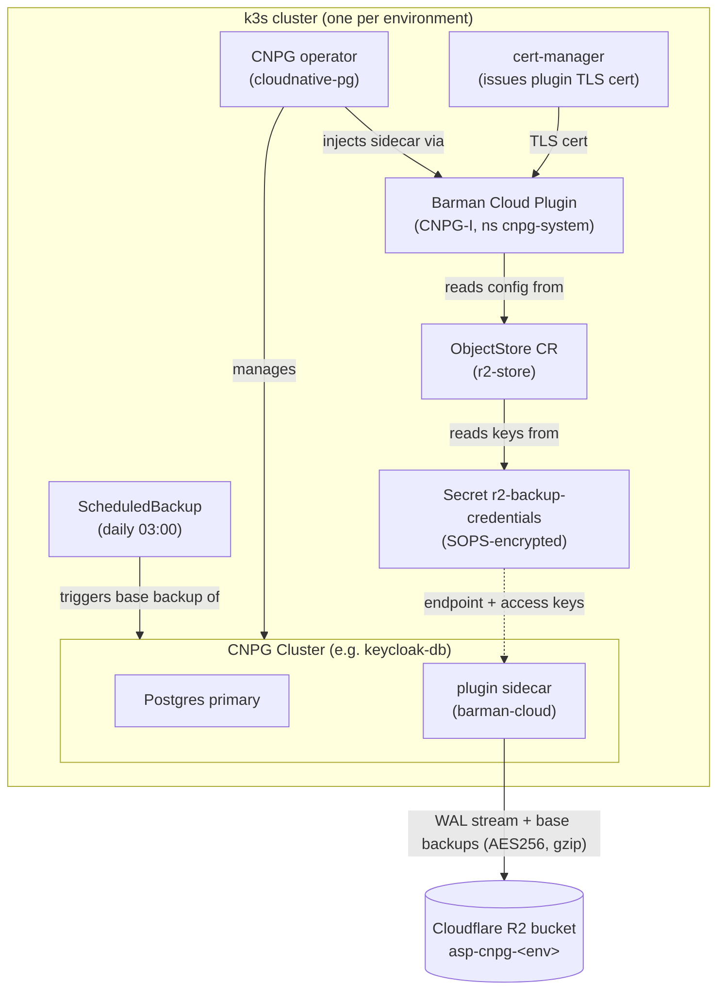
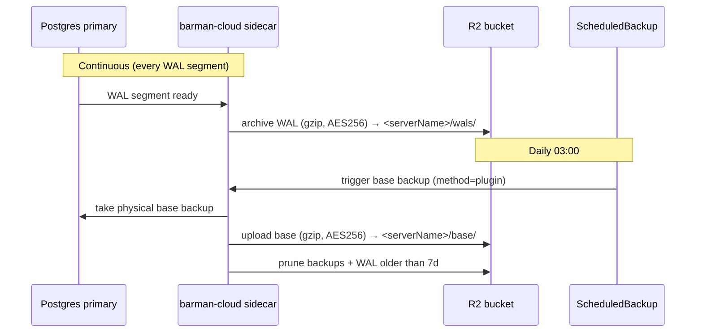
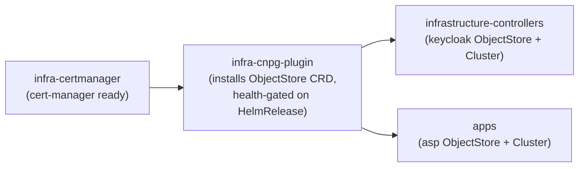

# Database Backups — CNPG → Cloudflare R2 & Garage

Every CNPG Postgres cluster ships continuous, restore-verified backups to an
S3-compatible object store — **Cloudflare R2**, or off-cluster **Garage** for
fbref. The design gives **point-in-time recovery (PITR)**: a daily physical base
backup plus continuous WAL archiving, so the database can be restored to any
moment within the retention window.

Four clusters are protected:

| Cluster | Namespace | Backend | Bucket | Holds |
|---|---|---|---|---|
| `keycloak-db` | `identity` | Cloudflare R2 | `keycloak-cnpg-staging` | Keycloak realms, users, sessions |
| `asp-db` | `asp` | Cloudflare R2 | `asp-cnpg-staging` | Automarket scraper data |
| `fbref-db` | `fbref` | **Garage** (off-cluster, via the gateway) | `cnpg-staging-fbref` | fbref scraper data, the largest DB in the cluster |
| `ai-gateway-db` | `ai-gateway` | **Garage** (off-cluster, via the gateway) | `cnpg-staging-ai-gateway` | Bifrost providers, virtual keys, routing rules |

Three are **not** protected, deliberately or otherwise:

| Cluster | Why |
|---|---|
| `n8n-db` | ObjectStore is written and staged but commented out of the kustomization until a Garage key is minted. This is the highest priority gap in the repo: it is the only copy of every workflow and every stored credential. See `10-n8n-automation.md`. |
| `scraper-db` | Queues, config and health only; rebuilt from the platform. |
| `dbtools-db` | Scratch database for pgAdmin and nao. |

GLPI's MariaDB StatefulSet has no backup of any kind either, and neither does
AzuraCast's embedded MariaDB. With no Longhorn `backupTarget`, none of that
survives a full-cluster rebuild.

R2 and Garage use the **same** barman-cloud plugin; only the ObjectStore endpoint
+ credentials differ. The Garage path is detailed below and in `09` and `12`.

## Components and how they interact



- **cert-manager** — hard dependency of the plugin; mints the TLS cert the plugin
  uses for its gRPC endpoint to the operator.
- **CNPG operator** — manages the Postgres clusters and, when a cluster declares
  the plugin, injects the `barman-cloud` sidecar into each instance pod.
- **Barman Cloud Plugin (CNPG-I)** — installs the `ObjectStore` CRD and performs
  the actual upload/download against R2. Lives in `cnpg-system`.
- **ObjectStore CR (`r2-store`)** — per-namespace config: R2 bucket
  (`destinationPath`), endpoint, credentials ref, compression, AES256 encryption,
  retention (`7d`), and the R2 checksum-compatibility env vars.
- **Secret `r2-backup-credentials`** — SOPS-encrypted R2 access key id + secret.
  One value per environment, present in each namespace that runs a cluster.
- **Cluster `.spec.plugins`** — attaches the cluster to the plugin and marks it
  the WAL archiver; sets `serverName`, the per-cluster prefix inside the bucket.
- **ScheduledBackup** — fires a daily physical base backup via the plugin method.

## Storage layout

**One bucket per consumer**, with a key scoped to that bucket. The original design
was one shared bucket per environment separated by `serverName`, and it was
abandoned for a specific reason: sharing asp's bucket would put a credential in
the `identity` namespace that can also rewrite the asp archive — which is the
archive you would be restoring from on the day you need both.

```
keycloak-cnpg-staging/     asp-cnpg-staging/     cnpg-staging-fbref/     cnpg-staging-ai-gateway/
└── keycloak-db/           └── asp-db/           └── fbref-db/           └── ai-gateway-db/
    ├── base/                  ├── base/             ├── base/               ├── base/
    └── wals/                  └── wals/             └── wals/               └── wals/
```

`serverName` is still the prefix inside the bucket, because barman's layout needs
it and because a recovered cluster must archive under a **different** name than
the one it restored from.

- **Credentials**: one token per bucket, Object Read & Write on that bucket only.
- **Encryption**: AES256 server-side on R2. **Not on Garage** — it supports only
  SSE-C, so setting AES256 there fails every upload. Garage objects are gzip
  compressed and nothing more.
- **Region**: every Garage ObjectStore must set `AWS_REGION` **and**
  `AWS_DEFAULT_REGION` to `garage`. Only `HeadBucket` enforces it, so a missing
  region is invisible on an established cluster and fatal on a new one. This cost
  two days of downtime on 2026-08-10; the postmortem is in `12`.
- **Retention**: `7d` everywhere except n8n's `30d`, since a bad workflow edit can
  go unnoticed for days. The plugin prunes base backups + WAL past the window.
- **Versioning and object lock**: enabled on the R2 buckets. **Garage has
  neither**, so anyone holding a write key can delete every object in its bucket.
  The mitigation is blast-radius reduction (per bucket keys), not prevention.

> The production overlays still point both prod clusters at a single shared
> `asp-cnpg-production` bucket, which is the layout staging moved away from. That
> tree is not deployed; fix it before it ever is.

## Backup data flow



WAL archiving + base backups together enable PITR: restore the latest base
backup, then replay WAL up to the chosen target time.

## Cloudflare R2 compatibility note

boto3 ≥ 1.36 sends S3 data-integrity checksums that R2 rejects
(`XAmzContentSHA256Mismatch`) — this breaks both archiving and restore
(upstream `plugin-barman-cloud` issue #411). The fix is baked into every
`ObjectStore` under `instanceSidecarConfiguration.env`:

```yaml
env:
  - name: AWS_REQUEST_CHECKSUM_CALCULATION
    value: when_required
  - name: AWS_RESPONSE_CHECKSUM_VALIDATION
    value: when_required
```

Because of this history, a **restore drill is mandatory** after enabling backups
in an environment — a backup that cannot restore is worthless.

## Second backend: Garage (fbref)

`fbref-db` backs up to an **off-cluster Garage** cluster instead of R2. Same
plugin, different ObjectStore (`garage-store`, `apps/staging/databases/fbref/`):

- **Endpoint**: the in-cluster HAProxy gateway
  `http://garage-s3.garage-gw.svc.cluster.local:3900`, which fails over across
  three Garage nodes reached over Tailscale (operator egress). Full gateway
  architecture in `documentations/09-etcd-backup-dr.md`.
- **No server-side encryption**: Garage has no SSE-S3/AES256 (SSE-C only), unlike
  R2 — the ObjectStore sets `wal`/`data` `compression: gzip` and **omits**
  `encryption:`. Setting AES256 would fail every upload.
- **Bucket**: `cnpg-staging-fbref` (barman layout `fbref-db/base|wals/`), key
  scoped to it (`garage-backup-credentials.enc.yaml`).
- Same defensive boto3 checksum-compat env as R2.

## Flux deployment order

The plugin installs the `ObjectStore` **CRD**; the `ObjectStore` **CRs** live in
other Kustomizations. Flux applies a Kustomization atomically, so a CR sharing a
Kustomization with its own CRD would deadlock (`no matches for kind ObjectStore`).
The CRD provider is therefore isolated and gated:



- `infra-certmanager` → `base/cert-manager` (cert-manager HelmRelease).
- `infra-cnpg-plugin` → `base/cnpg/plugin` (OCI chart `plugin-barman-cloud` from
  `oci://ghcr.io/cloudnative-pg/charts`). `dependsOn: infra-certmanager`,
  `wait: true`, health-gated on the `plugin-barman-cloud` HelmRelease.
- `infrastructure-controllers` and `apps` both `dependsOn: infra-cnpg-plugin`, so
  the CRD always exists before any `ObjectStore` is applied.

The CNPG **operator** install stays in `base/cnpg` (separate from the plugin) so
the already-running operator is never churned by this layering.

## File map

| Concern | Path |
|---|---|
| cert-manager | `infrastructure/controllers/base/cert-manager/` |
| Plugin (OCI HelmRelease + source) | `infrastructure/controllers/base/cnpg/plugin/` |
| CNPG operator | `infrastructure/controllers/base/cnpg/` |
| keycloak backup CRs | `infrastructure/controllers/<env>/keycloak/database/` |
| asp backup CRs | `apps/<env>/asp/` (`objectstore.yaml`, `scheduledbackup.yaml`, `cluster-backup-patch.yaml`, `r2-backup-credentials.enc.yaml`) |
| Flux ordering | `clusters/<env>/infrastructure.yaml`, `clusters/<env>/apps.yaml` |

## Operations

Trigger an on-demand backup (instead of waiting for 03:00):

```sh
kubectl cnpg backup keycloak-db -n identity \
  --method=plugin --plugin-name=barman-cloud.cloudnative-pg.io
```

Check archiving / backup status:

```sh
kubectl -n identity get cluster keycloak-db \
  -o jsonpath='{.status.conditions}'        # ContinuousArchiving=True
kubectl -n identity get scheduledbackup,backup
```

Restore drill (PITR) — recover into a throwaway cluster, verify, tear down:

```yaml
apiVersion: postgresql.cnpg.io/v1
kind: Cluster
metadata:
  name: keycloak-db-restore-test
  namespace: identity
spec:
  instances: 1
  bootstrap:
    recovery:
      source: keycloak-db
      recoveryTarget:
        targetTime: "2026-06-02 02:30:00+00"   # any point within 7d
  externalClusters:
    - name: keycloak-db
      plugin:
        name: barman-cloud.cloudnative-pg.io
        parameters:
          barmanObjectName: r2-store
          serverName: keycloak-db
```

### Restore drill — performed 2026-07-26 (fbref-db ← Garage)

From-scratch bootstrap-recovery of `fbref-db` out of Garage
(`cnpg-staging-fbref`, `serverName fbref-db`) into a throwaway
`fbref-restore-test` cluster (`bootstrap.recovery`, **no** `spec.plugins` so the
test cluster cannot archive back onto the source's chain):

- Reached `Cluster in healthy state` in **~2.5 min**.
- Restored DB matched the source **exactly**: **3488 MB**, 10 public tables,
  `player_stats` ~9.7M rows, `url_queue` ~275K, `players` ~30K.
- Source `fbref-db` stayed 2/2 healthy throughout; test cluster + PVC deleted after.

Confirms the Garage bucket can rebuild a fresh cluster end-to-end. Re-run after
any change to the Garage gateway/egress path. (etcd snapshot restore is a
separate drill — see `09-etcd-backup-dr.md`.)

Rotate the R2 token periodically: mint a new scoped token, update the SOPS secret
(`sops -e -i`), commit, then revoke the old token.

## Restoring from a SQL dump breaks the app credentials

Found 2026-08-24, on `dbtools-db`, `n8n-db` and `scraper-db` — the three clusters
rebuilt from `pg_dump` output rather than Barman.

CNPG generates the `app` role's password and publishes it in the
`<cluster>-app` Secret. A dump that carries its own `CREATE ROLE` / `ALTER ROLE`
re-creates that role with the password it had on the *old* cluster, silently
overwriting the generated one. Nothing errors: the restore reports success, the
data is complete and correct, and `psql` as `postgres` works fine. Only
applications fail, with `28P01` — `password authentication failed` — which reads
like a misconfigured Secret rather than a clobbered role.

It cost a crashlooping `nao` and two failed HelmReleases before it was traced.
The five Barman-restored clusters were unaffected: a physical recovery restores
the whole cluster and CNPG resets the password afterwards.

Check every dump-restored cluster:

```bash
U=$(kubectl -n $NS get secret $CL-app -o jsonpath='{.data.username}' | base64 -d)
D=$(kubectl -n $NS get secret $CL-app -o jsonpath='{.data.dbname}'   | base64 -d)
PW=$(kubectl -n $NS get secret $CL-app -o jsonpath='{.data.password}' | base64 -d)
kubectl -n $NS exec $CL-1 -c postgres -- \
  env PGPASSWORD="$PW" psql -h 127.0.0.1 -U "$U" -d "$D" -tAc 'select 1'
```

An `exit code 2` instead of `1` is the symptom. Repair by putting the Secret
back in charge — it is the authority, not the dump:

```bash
kubectl -n $NS exec $CL-1 -c postgres -- \
  psql -tAc "ALTER ROLE \"$U\" WITH LOGIN PASSWORD '$PW'"
```

Better: strip roles from the dump before restoring (`pg_dump --no-owner
--no-acl`, or `pg_restore` without `-C`), so the cluster's own credentials are
never touched.
