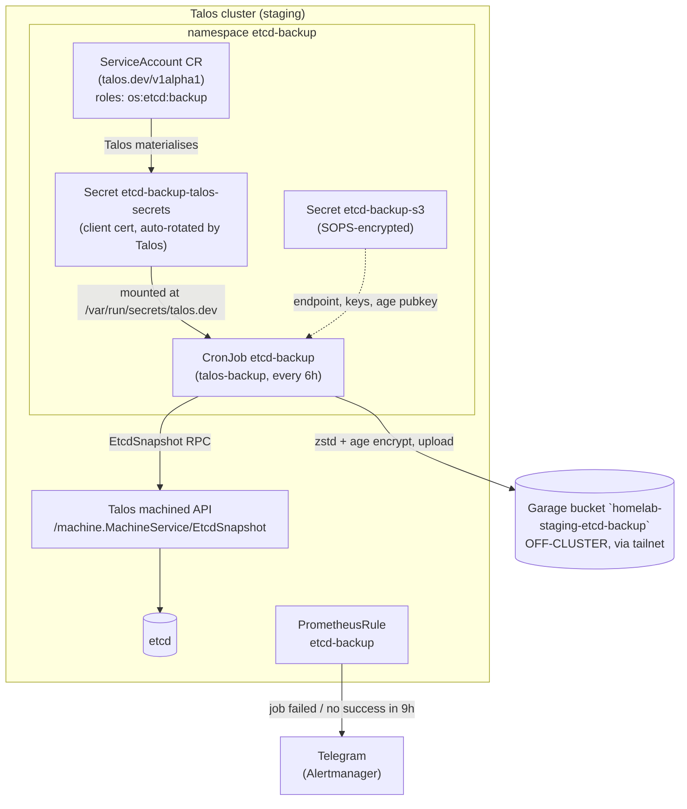

# etcd Backups & Disaster Recovery — Talos → Garage S3

etcd holds the entire Kubernetes control-plane state: every object, every
Secret. Losing 2 of the 3 control planes at once means total loss of service,
and without a snapshot the cluster is unrecoverable.

Snapshots run **every 6 hours** via a Flux-managed CronJob, are encrypted with
`age` before leaving the cluster, and land in the `homelab-staging-etcd-backup` bucket on an
**off-cluster** Garage host.

## What this does and does not cover

| Covered | Not covered |
|---|---|
| All Kubernetes API objects (Deployments, Secrets, ConfigMaps, CRs, RBAC…) | **Longhorn volume data** — a restore brings back PV/PVC *objects*, not their contents |
| Cluster membership + control-plane config | Talos machine PKI (lives in `bootstraping/talsecret.sops.yaml`) |
| | Postgres PITR — separately covered by CNPG → R2, see `03-backups.md` |

Longhorn currently has **no `backupTarget` configured**
(`infrastructure/controllers/base/longhorn/release.yaml`). Volume data survives
a node reset only because replicas live on `/var/lib/longhorn`, a bind mount
outside the wiped `EPHEMERAL` partition. That is resilience, not backup. Closing
this gap is the next piece of work.

## Components



### Why `kubernetesTalosAPIAccess` instead of a mounted `talosconfig`

`bootstraping/talconfig.yaml` enables:

```yaml
      features:
        kubernetesTalosAPIAccess:
          enabled: true
          allowedRoles:
            - os:etcd:backup
          allowedKubernetesNamespaces:
            - etcd-backup
```

Talos then watches for `talos.dev/v1alpha1` `ServiceAccount` CRs in that one
namespace and issues **short-lived, auto-rotated** client certs as a Secret.
The `os:etcd:backup` role grants exactly one API method —
`/machine.MachineService/EtcdSnapshot`. A leaked backup credential cannot read
machine config, fetch other secrets, or reboot a node.

The alternative — generating a long-lived `talosconfig` and committing it as a
SOPS secret — means a static credential with no rotation. Don't.

### Garage connectivity — the in-cluster gateway

talos-backup is an in-cluster pod, so it uploads via
`CUSTOM_S3_ENDPOINT = http://garage-s3.garage-gw.svc.cluster.local:3900` — the
**HAProxy gateway** (`infrastructure/services/{base,staging}/garage-gateway/`),
which load-balances + TCP-health-checks across three Garage nodes reached over
**Tailscale** (operator egress Services `garage-node-{a,b,c}` in
`infrastructure/controllers/staging/tailscale-operator/egress-proxies.yaml`). The
Talos nodes are **not** on the tailnet — the operator's userspace proxy pods are.
A **restore runs off-cluster** and goes **direct** to a Garage tailnet node (the
gateway is in-cluster only). fbref's CNPG backup rides the same gateway (`03`).

### Encryption

The snapshot contains every Kubernetes Secret in plaintext. `talos-backup`
encrypts it with `age` before upload. **Never set `DISABLE_ENCRYPTION`.**

> **talos-backup v0.1.0-beta.3 quirks** — both are worked around in
> `staging/etcd-backup/configmap.yaml` with inline comments; revisit when the
> pinned image is bumped (fixed on `main`):
> - It **concatenates** `AGE_RECIPIENT_PUBLIC_KEY` + `AGE_X25519_PUBLIC_KEY`
>   (`strings.Split` + append, no empty filter) — leaving one unset injects an
>   empty recipient and age fails `malformed recipient`. **Set both** to the same
>   key (age only warns on the duplicate).
> - Its `USE_PATH_STYLE` check is **inverted** (`== "false"`). Garage needs
>   path-style (virtual-host `bucket.<host>` won't resolve), so the configmap
>   sets `USE_PATH_STYLE: "false"` to actually enable it.

### Security limitation — Garage has no object lock or versioning

Unlike the R2 buckets used for CNPG (`03-backups.md`), Garage cannot make
objects immutable. Anyone holding the write key can delete every snapshot.
Mitigations in place: the Garage key is scoped to the `homelab-staging-etcd-backup` bucket only, and
the age **private** key is stored outside the cluster entirely. Full 3-2-1
(replicating snapshots to the existing R2 account) is a deliberate future step.

## File map

| Concern | Path |
|---|---|
| Talos API access feature | `bootstraping/talconfig.yaml` (machine patch) |
| Namespace, ServiceAccount CR, CronJob | `infrastructure/services/base/etcd-backup/` |
| S3 + age config (SOPS) | `infrastructure/services/staging/etcd-backup/etcd-backup-s3.enc.yaml` |
| Overlay wiring | `infrastructure/services/staging/kustomization.yaml` |
| Alerting | `monitoring/configs/staging/etcd-backup-alerts/` |

## Retention

`talos-backup` does not prune. Set a lifecycle expiry on the bucket from the
Garage host — 30 days, which at 4 snapshots/day is ~120 objects:

```bash
aws --endpoint-url http://<garage-host>:3900 s3api put-bucket-lifecycle-configuration \
  --bucket homelab-staging-etcd-backup --lifecycle-configuration file://lifecycle.json
```

If the installed Garage version does not support lifecycle rules, add a small
prune CronJob rather than letting the bucket grow unbounded.

## Offsite prerequisites — a restore is impossible without these

None of these may live only on the cluster:

- **`clusters/staging/age.agekey`** — gitignored. Decrypts both
  `talsecret.sops.yaml` and every `.enc.yaml`. **Lose this and the cluster
  cannot be rebuilt**, snapshots or not.
- **The age backup private key** (`etcd-backup-age.key`) — decrypts the
  snapshots themselves. Never committed, not even SOPS-encrypted: doing so
  would make it depend on the key above, so one loss would take out both.
- **Git repo access** — holds `talsecret.sops.yaml`, the Talos PKI.

Store all three in a password manager or offline medium.

## Operations

Trigger a backup on demand:

```bash
kubectl -n etcd-backup create job --from=cronjob/etcd-backup manual-test-1
kubectl -n etcd-backup logs job/manual-test-1
```

List what is in the bucket:

```bash
aws --endpoint-url http://<garage-host>:3900 s3 ls s3://homelab-staging-etcd-backup/staging/
```

Verify a snapshot is a valid etcd database (do this periodically):

```bash
age -d -i etcd-backup-age.key -o db.snapshot <downloaded-object>
etcdutl snapshot status db.snapshot -w table   # revision + total keys must be sane
```

Rotate the Garage key: mint a new scoped key, update the SOPS secret
(`sops -e -i`), commit, then revoke the old key.

## Recovery

### Case 1 — one control plane lost (2 of 3 healthy)

**Do not restore from a snapshot.** etcd still has quorum; restoring would
discard live state. Reset the bad node and let it rejoin:

```bash
talosctl -n <bad-node-ip> reset --graceful=false --reboot --system-labels-to-wipe=EPHEMERAL
```

It rejoins etcd automatically once it comes back up.

### Case 2 — quorum lost (2 or 3 control planes gone)

This is the only situation calling for a snapshot restore. Work through the
steps in order; do not run step 5 on more than one node.

**1. Retrieve and decrypt the newest snapshot**

```bash
aws --endpoint-url http://<garage-host>:3900 s3 ls s3://homelab-staging-etcd-backup/staging/
aws --endpoint-url http://<garage-host>:3900 s3 cp s3://homelab-staging-etcd-backup/staging/<newest> .
age -d -i etcd-backup-age.key -o db.snapshot <newest>
```

If compression was enabled, decompress with `zstd -d` after decrypting.

**2. Rebuild node configs from the same `talsecret`** (identical PKI, so your
existing `talosconfig` and certs keep working):

```bash
cd bootstraping
SOPS_AGE_KEY_FILE=../clusters/staging/age.agekey talhelper genconfig
```

**Never regenerate `talsecret.sops.yaml`** — new PKI means a dead cluster.

**3. Wipe the ephemeral partition on all three control planes**

```bash
talosctl -n 192.168.1.101 reset --graceful=false --reboot --system-labels-to-wipe=EPHEMERAL
talosctl -n 192.168.1.102 reset --graceful=false --reboot --system-labels-to-wipe=EPHEMERAL
talosctl -n 192.168.1.103 reset --graceful=false --reboot --system-labels-to-wipe=EPHEMERAL
```

**4. Wait until etcd reports `Preparing` on the node you will recover on**

```bash
talosctl -n 192.168.1.101 service etcd
```

**5. Recover — on one node only**

```bash
talosctl -n 192.168.1.101 bootstrap --recover-from=./db.snapshot
```

`bootstrap` verifies the snapshot hash. Only add `--recover-skip-hash-check` if
the snapshot was copied raw out of `/var/lib/etcd/member/snap/db` rather than
produced by `talosctl etcd snapshot`.

**6. Let the other two nodes rejoin**

Nodes `.102` and `.103` join etcd automatically once the control-plane endpoint
is up. **Do not run `bootstrap` on them.**

**7. Verify**

```bash
talosctl -n 192.168.1.101 health --wait-timeout 10m
kubectl get nodes
flux get kustomizations
flux get helmreleases -A
```

Then check Longhorn volumes reattach, remembering that their *data* was never in
etcd — only the PV/PVC objects were.

### Manual snapshot (before a risky change)

The pattern already used in `07-talos-ha-expansion.md` and
`08-cilium-cni-ingress-migration.md`:

```bash
talosctl -n 192.168.1.101 etcd snapshot bootstraping/etcd-pre-<change>.snapshot
```

If etcd is already unhealthy and the API will not serve a snapshot, copy the
database directly (then restore with `--recover-skip-hash-check`):

```bash
talosctl -n 192.168.1.101 cp /var/lib/etcd/member/snap/db .
```

## Restore drill — proof it works (run this, don't trust the design)

A backup you have never restored is a hypothesis. This section turns it into
evidence. Three tiers, cheapest first; **Tier 1 is the one to run on a schedule**
— it is a real restore, off to the side, that cannot touch the live cluster.

> **Status — deployed & partially verified 2026-07-26.** The stack is live: the
> CronJob runs every 6h (the 18:00 run landed
> `Homelab_staging-2026-07-26T18:00:13Z.snap.age` unattended), the object is
> retrievable through the gateway and is a valid `age` file
> (`age-encryption.org/v1` header, 156 MB), and a fresh snapshot of this
> cluster's etcd validates as a well-formed DB — `revision 30365476, 2116 keys,
> valid hash` (that line is `etcdutl snapshot status`). The **restore mechanics
> are now proven in the devcontainer** (2026-07-26): a live 156 MB snapshot
> (`revision 30375269, 2141 keys`, etcd `3.6.0`) restored cleanly with `etcdutl
> snapshot restore` into a valid data-dir (`member/snap/db` + WAL), and the
> age + zstd decrypt/decompress chain roundtrips byte-identical. **Only step not
> yet run against the real Garage object:** the `age -d` with the **offline** age
> private key (yours) — that last decrypt is the operator's to finish. Run it
> once and record the result here — `mise run etcd-drill` does the whole thing
> (see below).
>
> Tools: the devcontainer now ships the whole chain — `aws`, `age`, `zstd`,
> `talosctl`, and native `etcdutl`/`etcdctl`/`etcd` (v3.7.1, reads the cluster's
> 3.6.x snapshots). No `docker` needed for Tier 1.

### Fastest path — `scripts/etcd-restore-drill`

Tiers 0 and 1 are wrapped in a read-only script that runs every manual step
below and cleans up after itself. From the devcontainer:

```bash
mise run etcd-drill -- --offline-key ~/etcd-backup-age.key   # key from a file
mise run etcd-drill                                          # omit it: paste the key when prompted (hidden, never written to disk)
mise run etcd-drill -- --keep                                # keep the workdir to inspect (leaves plaintext secrets on disk)
```

It port-forwards the gateway, pulls the Garage read creds from the SOPS secret,
fetches the newest snapshot, decrypts (offline key — **file or pasted**) and
decompresses, runs `etcdutl snapshot status`, restores into a throwaway etcd, and
counts `/registry` keys — then **shreds every plaintext file on exit**, even on
Ctrl-C. A pasted key is fed to age over stdin, so it never touches disk. The
destructive Tier 2 is intentionally **not** scripted.

The manual steps below are the same flow, for understanding and for Tier 2.

Set the endpoint once for the commands below:

```bash
# Off-cluster tailnet device: hit a Garage node's tailnet IP DIRECTLY (the
# in-cluster garage-s3 gateway is not reachable off-cluster). IPs in egress-proxies.yaml.
GARAGE=http://<garage-tailnet-ip>:3900
```

Or **from this devcontainer** (not on the tailnet): port-forward the in-cluster
gateway in a second shell, then point at localhost. Garage read creds come from
the SOPS secret:

```bash
kubectl -n garage-gw port-forward svc/garage-s3 3900:3900   # leave running
GARAGE=http://localhost:3900
S=infrastructure/services/staging/etcd-backup/etcd-backup-s3.enc.yaml
export AWS_ACCESS_KEY_ID=$(sops -d --extract '["stringData"]["AWS_ACCESS_KEY_ID"]' "$S")
export AWS_SECRET_ACCESS_KEY=$(sops -d --extract '["stringData"]["AWS_SECRET_ACCESS_KEY"]' "$S")
export AWS_DEFAULT_REGION=garage
```

### Fetch and decrypt the newest snapshot

`talos-backup` names objects `Homelab_staging-<RFC3339>.snap.zst.age` — it takes
the snapshot, compresses with zstd, then age-encrypts, so you **decrypt first,
then decompress**. RFC3339 timestamps sort chronologically, so the last line is
the newest:

```bash
OBJ=$(aws --endpoint-url "$GARAGE" s3 ls s3://homelab-staging-etcd-backup/staging/ | sort | tail -n1 | awk '{print $NF}')
aws --endpoint-url "$GARAGE" s3 cp "s3://homelab-staging-etcd-backup/staging/$OBJ" .

age -d -i etcd-backup-age.key -o snapshot.zst "$OBJ"   # object ends .zst.age
zstd -d snapshot.zst -o db.snap
# If ENABLE_COMPRESSION was false (object ends .snap.age):
#   age -d -i etcd-backup-age.key -o db.snap "$OBJ"   # and skip zstd
```

### Tier 0 — integrity

```bash
etcdutl snapshot status db.snap -w table
```

A non-zero **revision** and a sane **total-keys** count prove the file is a
structurally valid etcd database. Necessary, not sufficient — it does not prove
the *contents* are your cluster.

### Tier 1 — restore it and read the real cluster state (safe, repeatable)

Rebuild an actual etcd member from the snapshot and query it — all local, the
live cluster is never contacted.

**In the devcontainer (native, no docker):**

```bash
etcdutl snapshot restore db.snap --data-dir ./drill \
  --name drill --initial-cluster drill=http://localhost:2380 \
  --initial-advertise-peer-urls http://localhost:2380

etcd --name drill --data-dir ./drill \
  --initial-cluster drill=http://localhost:2380 \
  --initial-advertise-peer-urls http://localhost:2380 \
  --listen-peer-urls http://localhost:2380 \
  --listen-client-urls http://127.0.0.1:2379 \
  --advertise-client-urls http://127.0.0.1:2379 \
  --force-new-cluster &                        # serves the restored DB in the background

# How many Kubernetes objects are really in there?
etcdctl --endpoints=http://127.0.0.1:2379 get /registry --prefix --keys-only | grep -c .

# Spot-check objects you know exist:
etcdctl --endpoints=http://127.0.0.1:2379 get /registry/namespaces --prefix --keys-only
etcdctl --endpoints=http://127.0.0.1:2379 get /registry/secrets/etcd-backup --prefix --keys-only

kill %1 && rm -rf ./drill db.snap snapshot.zst "$OBJ"   # stop etcd + wipe (snapshot holds every Secret)
```

**Alternative — throwaway container** (outside the devcontainer). Match the image
to the cluster's **etcd 3.6.x** line:

```bash
docker run --rm -d --name etcd-drill \
  -v "$PWD:/work" -w /work --entrypoint sh \
  gcr.io/etcd-development/etcd:v3.6.4 -c '
    etcdutl snapshot restore db.snap --data-dir /drill \
      --name drill --initial-cluster drill=http://localhost:2380 \
      --initial-advertise-peer-urls http://localhost:2380 &&
    exec etcd --name drill --data-dir /drill \
      --initial-cluster drill=http://localhost:2380 \
      --initial-advertise-peer-urls http://localhost:2380 \
      --listen-peer-urls http://localhost:2380 \
      --listen-client-urls http://0.0.0.0:2379 \
      --advertise-client-urls http://localhost:2379 \
      --force-new-cluster'
docker exec etcd-drill etcdctl get /registry --prefix --keys-only | grep -c .
docker rm -f etcd-drill && rm -rf db.snap snapshot.zst "$OBJ"
```

Seeing thousands of `/registry/...` keys — your namespaces, your Secrets, the
`etcd-backup` objects this system itself created — is the proof: the snapshot is
a live, restorable copy of the whole control plane, not just a well-formed file.
(Talos does not encrypt etcd at rest, so the keys list in plaintext; the *values*
are Kubernetes-encoded protobuf. The key list is the evidence.) The cluster runs
etcd `3.6.x`; the devcontainer's `etcdutl` 3.7.1 restores its snapshots fine.

### Tier 2 — full cluster rehearsal (the real "the system failed" test)

Tier 1 proves the data. Only a full restore proves the *procedure*. Two ways:

- **Ephemeral cluster (recommended).** Provision three throwaway Talos nodes
  (VMs) from the **same `talsecret.sops.yaml`** — the snapshot's ServiceAccount
  tokens and etcd member certs only validate against the original PKI, so a fresh
  `talsecret` would fail (adjust node IPs/VIP in a copy of `talconfig.yaml`). Then
  run the **Case 2** restore flow — retrieve and decrypt the snapshot,
  `bootstrap --recover-from` on one node, let the others rejoin, verify — against
  those nodes, point a kubeconfig at their VIP, and confirm
  `kubectl get ns,secrets -A` matches production counts. Tear the VMs down after.
- **In-place on staging — destructive.** The ultimate proof, because it is not a
  simulation. It wipes the real control plane; only in a maintenance window, and
  only because this is a learning cluster you can afford to lose. Follow **Case 2**
  exactly.

> **Warning — in-place drill.** `talosctl reset --system-labels-to-wipe=EPHEMERAL`
> on all three nodes destroys the running control plane. If the snapshot, the age
> private key, or `clusters/staging/age.agekey` is bad or missing, the cluster is
> gone for good. Confirm Tier 1 passed on the *current* snapshot **first**, and
> confirm you hold all three offsite prerequisites, before wiping anything.

### The data tier — etcd alone is not a full recovery

An etcd restore brings back the CNPG `Cluster` CRs and their Secrets, but **not
the Postgres data** — that lives on Longhorn PVs and in the CNPG object store, not
in etcd. A complete DR proof therefore also restores each database from its backup
with `bootstrap.recovery` (the drill in `03-backups.md`).

That CNPG object store is **Cloudflare R2 today, not Garage** — there is no
CNPG-to-Garage configuration anywhere in the repo (`grep -ri garage` finds only
this etcd-backup stack). Moving CNPG to Garage would be a separate, deliberate
change (repoint each `objectstore.yaml` endpoint + credentials), not an
assumption to fold into this drill.

### What a pass looks like — capture it

Record these each drill (date, snapshot object name, and the numbers) as the
evidence the system works:

| Tier | Evidence of success |
|---|---|
| 0 | `snapshot status` shows non-zero revision + total keys |
| 1 | `/registry` key count in the thousands; named objects you recognize appear |
| 2 | restored cluster: `kubectl get ns,nodes,secrets -A` ≈ production; app pods Running; `flux get kustomizations` all Ready |

## A backup that cannot restore is worthless

`03-backups.md` states this principle for the CNPG backups and it applies here
just as much. Snapshot-status verification (above) is the minimum gate. A full
restore drill against a throwaway VM cluster is the real test and should be
scheduled periodically.
