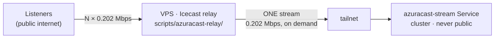

# AzuraCast — public listeners via an off-site relay

How real people reach the stream without the cluster being reachable from the
internet, and how to measure what that actually costs.

Doc 10 measured the server: **0.202 Mbps per listener**, everything else flat.
This doc is about where those megabits come from, and it changes that document's
conclusion — the home uplink stops being the ceiling.

## The shape



The relay dials **out** to the tailnet. No router port is opened, nothing at home
is reachable from the internet, and the home uplink carries a single stream
whatever the audience does. With `on-demand=1` it carries nothing at all while
nobody is listening.

The alternative — forwarding a router port to a LoadBalancer address — makes the
home uplink the ceiling (about 99 listeners on a typical 20 Mbps upload) and puts
Icecast on the public internet from the family connection. The relay costs one
rented machine and removes both problems.

## The constraint is transfer, not bandwidth

On a rented server the interesting limit is the **monthly transfer allowance**,
and it binds far earlier than throughput does:

> 0.202 Mbps sustained for 30 days ≈ **65 GB per listener-month**

| Continuous listeners | Per month | Fits a plan of |
|---:|---:|---|
| 10 | 0.65 TB | 1 TB |
| 50 | 3.3 TB | 4 TB |
| 100 | 6.5 TB | 10 TB |
| 1 000 | 65 TB | few consumer plans |

A 1 TB/month VPS sustains roughly **15 continuous listeners**. This is why
`MAX_CLIENTS` in the relay's `.env` is documented as a spend control rather than
a performance setting: it is the cap that keeps a popular evening from becoming
an overage bill. Real audiences are not continuous, so the true figure is average
concurrency × 65 GB — but size the cap against the worst case.

If the allowance is the binding limit, the lever is the same one doc 10 found:
**bitrate**. 128 kbps is 43 GB per listener-month, 96 kbps is 32 GB.

## Measuring the real test

Two halves, because a bad listening experience has two possible owners.

### Server side — `scripts/azuracast-load-test/watch-live.sh`

Samples every 10 s into a CSV: relay listener count, master CPU, RAM and egress.
Drives nothing; real listeners arrive when they arrive, and the file records the
arrival curve and the peak.

**Read the audience size from the relay, never from AzuraCast.** The master sees
exactly one listener — the relay — no matter how many people are connected. The
AzuraCast dashboard will say 1 all evening, and it is not wrong about what it
measures; it is just not measuring the audience.

### Listener side — the page at the relay's `/`

Each tester opens it and runs a 60-second measurement of their own connection:
sustained rate, time to first audio, longest gap, interruption count. It reports
the result by requesting `/report?kbps=…`, which **404s on purpose** — Icecast
writes the query string to its access log, and `collect-reports.sh` reads it back
out. No endpoint to write, nothing to secure, nothing to keep running.

Two details that make the numbers mean something:

- **The first five seconds are discarded.** Icecast bursts a backlog on connect
  so players start instantly; measuring through that reports a rate several times
  the real one.
- **Rate is not the signal — gaps are.** Icecast paces the socket at the mount
  bitrate, so every healthy listener measures ≈192 kbps and no one measures more.
  What separates a good connection from a bad one is whether the audio ever
  stopped arriving. The page says so, in both languages, because a tester reading
  "192 kbps" needs to know that matching is the pass condition.

## Security posture

- **Master never public.** The only egress is the `azuracast-stream` tailnet
  Service, carrying :8000 alone — deliberately not the main Service, whose :80 is
  the admin console.
- **`MAX_CLIENTS` is the bill cap.** Set it against the transfer allowance.
- **Icecast's admin console shares port 8000.** Password-protected, but block
  `/admin` at the reverse proxy too; the test needs nothing from it.
- **`<public>0</public>`** keeps the mount out of the Icecast YP directories.
- **Reports carry no identity** — six numbers, and the collector truncates client
  IPs to two octets.
- **TLS belongs in front of Icecast**, which serves plain HTTP. A browser will
  refuse audio loaded over HTTP from an HTTPS page: the page appears, the sound
  never starts.

## Runbook

```bash
# 1. cluster: the tailnet Service ships with the app (Flux). Confirm the device:
tailscale status | grep azuracast-stream

# 2. VPS:
tailscale up
cd scripts/azuracast-relay && cp .env.example .env && $EDITOR .env
docker compose up -d --build
curl -sI http://localhost:8000/radio.mp3          # 200 once a listener triggers the pull

# 3. send people the link, then watch both halves:
RELAY=https://radio.example.com ../azuracast-load-test/watch-live.sh 90
./collect-reports.sh > reports.csv
```

## What this still will not tell you

The relay's own bandwidth becomes the new ceiling, and it is not measured here —
a 1 Gbps VPS port serves ~4 000 listeners, but its transfer allowance runs out
long before. And real audiences churn: people connect and drop, and connection
setup scales with churn rather than with concurrency, which the synthetic sweep
in doc 10 deliberately excluded.
