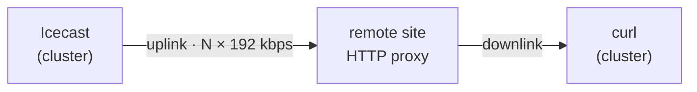

# AzuraCast — remote listeners without a VPS

Doc 13 measured what a listener costs the *server*: **0.202 Mbps**, everything
else flat. It could not measure the thing that actually decides audience size,
because every byte stayed inside the building.

This doc is the wide-area half: how many remote listeners the **home uplink**
can really serve, measured over the real internet, with no rented server, no
router port opened and nothing exposed.

## The idea

There are already two tailnet HTTP proxies at other sites — `tailscale-proxy-00`
(`100.100.98.5`, a residential line) and `tailscale-proxy-scrape-c`
(`100.92.142.13`, node C). They exist for the scraper's egress pools. They are
also, conveniently, real internet endpoints somewhere else.

Point in-cluster clients at the stream *through* them and the audio path becomes:



The stream leaves on the home uplink exactly as it would for a real listener at
that site. Ramp the count until listeners can no longer keep up, and the point
where that happens is the uplink's real capacity — measured, not calculated from
a link-speed figure.

Verified before trusting any of it: the tailnet path is **direct**, not relayed
through Tailscale's DERP servers (`tailscale ping` → `direct 176.171.110.96:41641`,
30 ms). A relayed path would still leave the uplink, but it would add somebody
else's capacity limit to the measurement.

### Why two sites, always scaled together

A single generator cannot tell "the uplink is full" from "that one remote line is
full". Two independent sites can:

| Symptom | Meaning |
|---|---|
| Both sites slow at once | The shared leg — the home uplink — is the limit |
| One site slow, one fine | That site's own connection is the limit; the uplink has more to give |

`run-remote-sweep.sh` encodes exactly this as its `verdict` column and stops the
ramp on `uplink-saturated`.

### Running it

```bash
kubectl apply -f scripts/azuracast-load-test/namespace.yaml \
              -f scripts/azuracast-load-test/listener-sim-remote.yaml
scripts/azuracast-load-test/run-remote-sweep.sh
```

**This deliberately saturates the household internet connection while it runs.**
Steps are per site, so `100` means 200 concurrent listeners. The sweep stops as
soon as it finds the ceiling — there is nothing to learn past it, and holding a
saturated uplink degrades everything else at that site.

The manifest ships `replicas: 0`, so re-applying it always parks the generators.
A `kubectl apply` after scaling resets them to zero; scale after applying, not
before.

### Reading the output

Each simulated listener reports the throughput it actually achieved, once per
120-second window. The floor is **24 000 B/s** — 192 kbps of payload. Below it a
real player is draining its buffer and will eventually go silent.

The headline is a **median**, not a mean: one stalled listener among fifty should
not drag the number down, and fifty struggling ones should not hide behind one
fast one.

Two traps this rig already avoids, both of which produce confident wrong answers:

- **`curl --max-time` exits non-zero on every completed window** while `-w` has
  already printed the real rate. An `|| echo 0` fallback therefore fires
  *alongside* each reading, and the median collapses to zero — the first version
  of this reported saturation at one listener.
- **Icecast bursts ~64 KiB on connect.** A short measurement window turns that
  into several percent of inflated throughput; the window is 120 s so it rounds
  away.

## The caveat that matters

The audio crosses the home connection **twice** — out on the uplink to the remote
proxy, back on the downlink to the measuring client. The ceiling this finds is
therefore `min(uplink, downlink) ÷ 192 kbps`.

On any connection where the downlink is the larger of the two — which is nearly
all of them — that equals the uplink figure, and the result is exactly right. It
would only understate the truth on a symmetric link whose two directions share
one pool of capacity.

## Public listeners are still an open question

This measures capacity. It does not publish anything: the stream remains
reachable only from the tailnet.

Serving the general public needs one of:

- **A port forward** at the cluster's site to a LoadBalancer address from the
  Cilium pool. Simple, and makes the home uplink the ceiling — which is precisely
  the number this test gives you.
- **A relay on an off-site machine you already own** (node C, say). The code is in
  `scripts/azuracast-relay/` and is written for exactly this: it pulls one copy
  over the tailnet and fans out locally, so the home uplink carries a single
  stream no matter the audience. It still needs a public path at *that* site —
  a port forward there, or Tailscale Funnel.
- **Not the Cloudflare tunnel.** Sustained audio is the ToS §2.8 case the
  cloudflare README documents; that hostname carries the web UI only.

If a relay ever runs on a metered connection, the number to plan against is
**~65 GB per listener-month** at 192 kbps — the relay README works that through.
