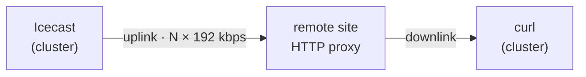

# AzuraCast — remote listeners without a VPS

Doc 13 measured what a listener costs the *server*: **0.202 Mbps**, everything
else flat. It could not measure the thing that actually decides audience size,
because every byte stayed inside the building.

This doc is the wide-area half: how many remote listeners the **home uplink**
can really serve, measured over the real internet, with no rented server, no
router port opened and nothing exposed.

## The idea

There are already two tailnet HTTP proxies at other sites — `tailscale-proxy-00`
(`100.100.98.5`, a residential line) and `tailscale-proxy-scrape-c`
(`100.92.142.13`, node C). They exist for the scraper's egress pools. They are
also, conveniently, real internet endpoints somewhere else.

Point in-cluster clients at the stream *through* them and the audio path becomes:



The stream leaves on the home uplink exactly as it would for a real listener at
that site. Ramp the count until listeners can no longer keep up, and the point
where that happens is the uplink's real capacity — measured, not calculated from
a link-speed figure.

Verified before trusting any of it: the tailnet path is **direct**, not relayed
through Tailscale's DERP servers (`tailscale ping` → `direct 176.171.110.96:41641`,
30 ms). A relayed path would still leave the uplink, but it would add somebody
else's capacity limit to the measurement.

### Why two sites, always scaled together

A single generator cannot tell "the uplink is full" from "that one remote line is
full". Two independent sites can:

| Symptom | Meaning |
|---|---|
| Both sites slow at once | The shared leg — the home uplink — is the limit |
| One site slow, one fine | That site's own connection is the limit; the uplink has more to give |

`run-remote-sweep.sh` encodes exactly this as its `verdict` column and stops the
ramp on `uplink-saturated`.

### Running it

```bash
kubectl apply -f scripts/azuracast-load-test/namespace.yaml \
              -f scripts/azuracast-load-test/listener-sim-remote.yaml
scripts/azuracast-load-test/run-remote-sweep.sh
```

**This deliberately saturates the household internet connection while it runs.**
Steps are per site, so `100` means 200 concurrent listeners. The sweep stops as
soon as it finds the ceiling — there is nothing to learn past it, and holding a
saturated uplink degrades everything else at that site.

The manifest ships `replicas: 0`, so re-applying it always parks the generators.
A `kubectl apply` after scaling resets them to zero; scale after applying, not
before.

### Reading the output

Each simulated listener reports the throughput it actually achieved, once per
120-second window. The floor is **24 000 B/s** — 192 kbps of payload. Below it a
real player is draining its buffer and will eventually go silent.

The headline is a **median**, not a mean: one stalled listener among fifty should
not drag the number down, and fifty struggling ones should not hide behind one
fast one.

Two traps this rig already avoids, both of which produce confident wrong answers:

- **`curl --max-time` exits non-zero on every completed window** while `-w` has
  already printed the real rate. An `|| echo 0` fallback therefore fires
  *alongside* each reading, and the median collapses to zero — the first version
  of this reported saturation at one listener.
- **Icecast bursts ~64 KiB on connect.** A short measurement window turns that
  into several percent of inflated throughput; the window is 120 s so it rounds
  away.

## Results, 2026-08-10

Both sites, ramped together (per-site counts; total is twice that):

| Per site | Total | Site B B/s | Site C B/s | Master TX | Verdict |
|---:|---:|---:|---:|---:|---|
| 1 | 2 | 24 433 | 24 519 | 42.5 KiB/s | ok |
| 5 | 10 | 24 372 | 24 530 | 231 KiB/s | ok |
| 15 | 30 | **10 001** | 24 521 | 644 KiB/s | one-site-limited |
| 30 | 60 | **0** | 24 503 | 1 159 KiB/s | one-site-limited |
| 60 | 120 | **416** | 24 428 | 1 719 KiB/s | one-site-limited |
| 100 | 200 | 314 | **18 798** | 2 022 KiB/s | (see below) |

**Site B — `tailscale-proxy-00`, the residential line — folds at about 1 Mbps.**
It served 5 listeners cleanly and had collapsed entirely by 15, while site C was
still delivering full rate to 60. That is roughly a 12× gap between the two
lines, and it matters beyond radio: this is the scraper's egress pool `00`, so
anything routed through it inherits that ceiling.

### The attribution run

The two-site discriminator assumes comparable lines. It failed here: site B had
been dead for three steps, so its 314 B/s at the last step was a corpse casting a
vote, and the `uplink-saturated` verdict it produced was not trustworthy.

Site C was therefore ramped **alone**:

| Setup | Site C at 100 | Master TX |
|---|---:|---:|
| Both sites | 18 798 B/s | 2 022 KiB/s |
| Site C alone | 18 666 B/s | 1 866 KiB/s |

Removing site B's entire load moved site C's rate by 0.7%. Had the home uplink
been the constraint, freeing that capacity would have helped. It did not.

> **The limit is node C's own connection — about 15.3 Mbps — not the home uplink.**

### What this does and does not establish

- **Demonstrated:** 60 concurrent remote listeners at full quality through a
  single off-site line, and 16.6 Mbps pushed out of the house without the uplink
  faltering.
- **Therefore the home uplink is ≥ 16.6 Mbps**, i.e. **≥ 80 listeners** at
  192 kbps.
- **The upper bound is unmeasured.** Both remote endpoints are weaker than the
  thing being measured, so this rig cannot push harder. Finding the real ceiling
  needs a remote endpoint with more capacity than the uplink — which is the same
  missing ingredient as publishing to the public.

## The caveat that matters

The audio crosses the home connection **twice** — out on the uplink to the remote
proxy, back on the downlink to the measuring client. The ceiling this finds is
therefore `min(uplink, downlink) ÷ 192 kbps`.

On any connection where the downlink is the larger of the two — which is nearly
all of them — that equals the uplink figure, and the result is exactly right. It
would only understate the truth on a symmetric link whose two directions share
one pool of capacity.

## Public listeners are still an open question

This measures capacity. It does not publish anything: the stream remains
reachable only from the tailnet.

Serving the general public needs one of:

- **A port forward** at the cluster's site to a LoadBalancer address from the
  Cilium pool. Simple, and makes the home uplink the ceiling — which is precisely
  the number this test gives you.
- **A relay on an off-site machine you already own** (node C, say). The code is in
  `scripts/azuracast-relay/` and is written for exactly this: it pulls one copy
  over the tailnet and fans out locally, so the home uplink carries a single
  stream no matter the audience. It still needs a public path at *that* site —
  a port forward there, or Tailscale Funnel.
- **Not the Cloudflare tunnel** — except that, as of 2026-08-10, it already is.
  See below.

## Audio is currently live over the Cloudflare tunnel

Measured from outside the network:

```
$ curl -D- https://mve-azuracast.eliorion.fr/listen/sysadmin/radio.mp3
HTTP/2 200
content-type: audio/mpeg
icy-br: 192
server: cloudflare
                                     27 666 B/s sustained over 15 s
```

The cloudflare README states that this hostname carries the web UI only. That is
now factually wrong: nginx proxies `/listen/*` to the local Icecast on the same
port 80 the tunnel already routes, so publishing the host published the audio
with it. The API confirms it — `listen_url` advertises exactly that URL, so any
player or embed will use it by default.

This is the sustained non-HTML streaming Cloudflare's ToS §2.8 restricts.

**Decided 2026-08-10: keep it.** The arrangement stands as the audio path for
now, with the risk accepted knowingly rather than inherited by accident, and the
cloudflare README has been corrected to describe what the hostname actually
serves. The fallbacks, if Cloudflare ever throttles or objects, are a direct path
(port forward to a Cilium LB-IPAM address — the uplink sustains at least 80
concurrent listeners, measured above) or an off-site relay. Closing it would be a
path-scoped tunnel route, the trick already used for Keycloak, or a WAF rule on
`/listen/*`.

If a relay ever runs on a metered connection, the number to plan against is
**~65 GB per listener-month** at 192 kbps — the relay README works that through.
