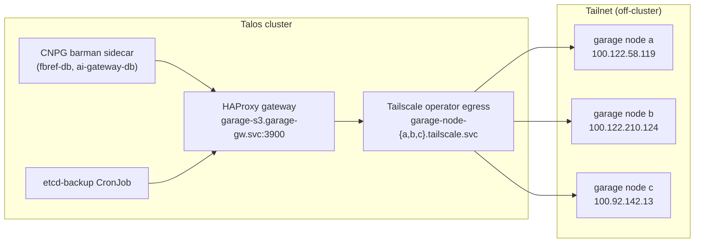

# Garage Object Storage — Operating It, and the WAL-Archiving Outage It Caused

**Garage** is the off-cluster, self-hosted S3 backend for this homelab: three
nodes on the tailnet, reached from the cluster through an in-cluster HAProxy
gateway. It stores the etcd snapshots (`09-etcd-backup-dr.md`) and the CNPG
backups that do not go to Cloudflare R2 (`03-backups.md`).

This document is the operator's side of it: how to reach the cluster, how to add
a bucket + key for a new consumer, how to verify a consumer is really writing,
and the postmortem of the 2026-08-10 outage where a missing region setting took
the AI gateway down for two days.

## Topology



- **One in-cluster endpoint**: `http://garage-s3.garage-gw.svc.cluster.local:3900`.
  Nothing in the cluster should dial a raw `100.x` address — HAProxy is not a
  tailnet member and load-balances + health-checks the three egress Services
  (`infrastructure/services/staging/garage-gateway/haproxy.cfg`).
- **Backend health**: `/stats` on port `8404` of a `garage-gateway` pod shows
  which nodes are up. The k8s probes deliberately do **not** gate on it.
- **Restores run off-cluster**, straight at a node's tailnet IP — the gateway is
  in-cluster only (`09-etcd-backup-dr.md`).

## The region is `garage`

Garage is configured with a non-AWS region name, and **every client must sign
with it**. This is not cosmetic:

| Operation | Wrong region (`us-east-1`) | Correct region (`garage`) |
|---|---|---|
| `ListObjectsV2` | works | works |
| `GetObject` / `PutObject` | works | works |
| **`HeadBucket`** | **`400 Bad Request`** | works |

Because almost everything tolerates the mismatch, a misconfigured client looks
healthy right up until something calls `HeadBucket` — see the postmortem below.

Set it as `AWS_REGION` (boto3, barman-cloud) **and** `AWS_DEFAULT_REGION` (aws
CLI, talos-backup). Current settings:

| Consumer | Where the region is set |
|---|---|
| etcd-backup | `infrastructure/services/staging/etcd-backup/configmap.yaml` (`AWS_REGION`) |
| `ai-gateway-db` | `infrastructure/services/staging/databases/ai-gateway/objectstore.yaml` (`instanceSidecarConfiguration.env`) |
| `fbref-db` | `apps/staging/databases/fbref/objectstore.yaml` (same) |

## Buckets and keys

One bucket per consumer, one key scoped to that bucket — no shared credentials.

| Bucket | Consumer | Credential Secret |
|---|---|---|
| `homelab-staging-etcd-backup` | Talos etcd snapshots | `etcd-backup-s3.enc.yaml` |
| `cnpg-staging-fbref` | `fbref-db` CNPG | `garage-backup-credentials` (ns `fbref`) |
| `cnpg-staging-ai-gateway` | `ai-gateway-db` CNPG | `ai-gateway-garage-backup-credentials` (ns `ai-gateway`) |

Barman's layout inside a bucket is `<serverName>/base/` + `<serverName>/wals/`.
**An empty `wals/` prefix on a live cluster means archiving is broken**, no
matter what the base backups say.

## Administering Garage

`garage` CLI, run **on a Garage node** (the admin API is not exposed through the
in-cluster gateway):

```bash
garage status                     # nodes + versions; all three should be listed
garage layout show                # partition assignment; unstaged changes show here
garage stats                      # capacity / object counts
```

Bucket and key lifecycle — the four commands that onboard a new consumer:

```bash
garage bucket create cnpg-staging-<name>
garage key create cnpg-<name>-key                 # prints GK... + the secret ONCE
garage bucket allow --read --write cnpg-staging-<name> --key cnpg-<name>-key
garage bucket info cnpg-staging-<name>            # confirm the key is listed
```

Inspection:

```bash
garage bucket list
garage key list
garage key info GK00debb39279144a579d8b7d2        # which buckets this key can touch
garage bucket deny --write cnpg-staging-<name> --key <old-key>   # rotation, step 2
```

Garage has **no object lock and no versioning** — anyone holding a write key can
delete every object in its bucket. That is why keys are bucket-scoped and why
the etcd age private key lives outside the cluster entirely.

### Poking the S3 API from inside the cluster

The fastest way to tell "Garage is broken" from "this client is misconfigured".
Throwaway pod, real credentials, gateway path — nothing persisted:

```bash
kubectl -n ai-gateway run s3check --rm -i --restart=Never --image=amazon/aws-cli:2.22.35 \
  --env=AWS_ACCESS_KEY_ID=$(kubectl -n ai-gateway get secret ai-gateway-garage-backup-credentials -o jsonpath='{.data.ACCESS_KEY_ID}' | base64 -d) \
  --env=AWS_SECRET_ACCESS_KEY=$(kubectl -n ai-gateway get secret ai-gateway-garage-backup-credentials -o jsonpath='{.data.ACCESS_KEY_SECRET}' | base64 -d) \
  --env=AWS_DEFAULT_REGION=garage \
  --command -- sh -c '
E=http://garage-s3.garage-gw.svc.cluster.local:3900
aws --endpoint-url $E s3api head-bucket --bucket cnpg-staging-ai-gateway && echo "head-bucket OK"
aws --endpoint-url $E s3 ls --recursive s3://cnpg-staging-ai-gateway | tail -5
aws --endpoint-url $E s3 ls --recursive s3://cnpg-staging-ai-gateway/ai-gateway-db/wals/ | wc -l'
```

Drop `AWS_DEFAULT_REGION` and the `head-bucket` line reproduces the outage
below exactly. The namespace's PodSecurity `restricted` label only warns, so the
pod schedules; it is deleted on exit.

## Onboarding a new CNPG cluster onto Garage

1. `garage bucket create` + `garage key create` + `garage bucket allow` (above).
2. SOPS-encrypt the key into the cluster's overlay as `ACCESS_KEY_ID` /
   `ACCESS_KEY_SECRET`. Never plaintext.
3. Write the `ObjectStore` next to the CNPG `Cluster`. Copy an existing Garage
   one — the three things that are not optional:
   - `AWS_REGION` + `AWS_DEFAULT_REGION` = `garage` in
     `instanceSidecarConfiguration.env`;
   - **no** `encryption:` under `wal:`/`data:` — Garage has no SSE-S3, only
     SSE-C, and AES256 fails every upload;
   - `endpointURL` pointing at the gateway Service, never a `100.x` address.
4. Patch the `Cluster` with the `barman-cloud.cloudnative-pg.io` plugin and
   `isWALArchiver: true`.
5. **Verify within 15 minutes of the cluster going Ready** — step 3 of the
   checklist below. A cluster that never archives looks perfectly healthy for
   about two days.

## Verifying a consumer actually archives

```bash
# 1. CNPG's own verdict
kubectl -n <ns> get cluster <cluster> \
  -o jsonpath='{range .status.conditions[*]}{.type}={.status} {.message}{"\n"}{end}'
# want: ContinuousArchiving=True "Continuous archiving is working"

# 2. Postgres' archiver counters — failed_count must not be climbing
kubectl -n <ns> exec <cluster>-1 -c postgres -- \
  psql -U postgres -c 'select archived_count, failed_count, last_failed_time from pg_stat_archiver'

# 3. Objects on the far side — the only check that cannot lie
#    (throwaway aws-cli pod above): <serverName>/wals/ must be non-empty
```

## Postmortem — 2026-08-10, AI gateway down for ~2 days

**Symptom.** `ai-gateway` (Bifrost) pod in `CrashLoopBackOff`, 187 restarts:

```
failed to connect to `user=bifrost database=bifrost`: 10.104.43.178:5432 (ai-gateway-db-rw):
dial error: dial tcp 10.104.43.178:5432: connect: no route to host
failed to bootstrap server: failed to load config ...
```

Nothing was wrong with the gateway's database wiring. `ai-gateway-db-rw` simply
had no ready endpoint: `ai-gateway-db-1`, the primary, was itself crash-looping,
and CNPG reported the cluster as `Not enough disk space`.

**The chain, in order:**

1. `ai-gateway-db` was created 2026-08-07 18:39. Its very first WAL archive
   attempt failed and never stopped failing:
   ```
   barman-cloud-check-wal-archive checking the first wal
   ERROR: Barman cloud WAL archive check exception:
   An error occurred (400) when calling the HeadBucket operation: Bad Request
   Error invoking barman-cloud-check-wal-archive ... exit status 4
   ```
   `ContinuousArchiving=False` from that minute onward.
2. barman-cloud sets no AWS region, so boto3 signed as `us-east-1`. Garage's
   region is `garage`, and **only `HeadBucket` enforces it**. Base backups (PUT)
   and the replica's WAL restores (GET) kept working with the same wrong region
   — which is why the failure was invisible: `LastBackupSucceeded=True` the whole
   time, while `cnpg-staging-ai-gateway/ai-gateway-db/wals/` held **0 objects**.
3. Postgres cannot recycle a WAL segment it has not archived. `pg_wal` grew
   unbounded on the primary's 10Gi volume: `actualSize` reached **9.94Gi of
   10Gi**, while the replica sat at 686Mi.
4. CNPG's low-disk guard shut the primary down and kept it down:
   ```
   Checking for free disk space for WALs after PostgreSQL finished
   Detected low-disk space condition
   ```
5. No primary anywhere (`instancesReportedState` showed `isPrimary: false` for
   both). The replica could not be promoted either — it was waiting for
   `000000010000000200000069`, a segment that exists only in the dead primary's
   `pg_wal` and was never archived.
6. `ai-gateway-db-rw`'s only EndpointSlice entry was `ready: false`, so the
   ClusterIP had no backend and Bifrost's connect returned `no route to host`.

**Why no other Garage consumer was affected.** `etcd-backup` already sets
`AWS_REGION: "garage"`. `fbref-db` never sets it, but its archive is non-empty,
and `barman-cloud-check-wal-archive` only runs the HeadBucket path while the
archive is **empty** ("checking the first wal"). The bug is therefore invisible
on every established cluster and fatal on every new one — including any cluster
rebuilt by a restore drill.

**Confirmation.** Same key, same gateway, same bucket, region varied:

```
--- region=us-east-1 : An error occurred (400) when calling the HeadBucket operation: Bad Request
--- region=garage    : (success)
--- region=eu-west-1 : An error occurred (400) when calling the HeadBucket operation: Bad Request
```

30/30 `HeadBucket` calls succeeded with the correct region — Garage, the gateway,
the bucket and the credentials were all healthy throughout.

**Fix (this PR):**

- `AWS_REGION` + `AWS_DEFAULT_REGION` = `garage` on the `ai-gateway` ObjectStore
  — the actual root cause.
- Same on `fbref-db`'s ObjectStore, where it is a restore-time landmine.
- `ai-gateway-db` storage `10Gi` → `20Gi`. Recovery is otherwise deadlocked:
  Postgres must be running to drain the WAL backlog, and CNPG refuses to start
  it without free space.

**Recovery after Flux reconciles:**

```bash
# 1. PVC expansion (CNPG drives it; Longhorn expands online)
kubectl -n ai-gateway get pvc ai-gateway-db-1 -o jsonpath='{.status.capacity.storage}{"\n"}'

# 2. Primary comes back, cluster leaves "Not enough disk space"
kubectl -n ai-gateway get cluster ai-gateway-db -w

# 3. The backlog drains — archived_count climbs, failed_count stops
kubectl -n ai-gateway exec ai-gateway-db-1 -c postgres -- \
  psql -U postgres -c 'select archived_count, failed_count from pg_stat_archiver'

# 4. WALs finally land in Garage (was 0)
#    -> throwaway aws-cli pod, `s3 ls --recursive .../ai-gateway-db/wals/ | wc -l`

# 5. Bifrost recovers on its own once ai-gateway-db-rw has a ready endpoint
kubectl -n ai-gateway get pods
```

If `pg_wal` is still near-full after the primary starts, let it run: the
archiver drains the backlog and the next checkpoint recycles the segments. Do
**not** delete files from `pg_wal` by hand — that corrupts the timeline.

**Follow-ups, not done here:**

- **No alert covers this.** `03-backups.md` monitors backups, not archiving, and
  the cluster reported `LastBackupSucceeded=True` throughout a total archiving
  failure. A `PrometheusRule` on the CNPG archiver metrics (CNPG's PodMonitors
  are already enabled) — `cnpg_pg_stat_archiver_failed_count` climbing, or
  `ContinuousArchiving=False` for 15m — would have caught this on day one, and
  a disk-usage alert on the CNPG PVCs would have caught it again on day two.
  Model it on `monitoring/configs/staging/etcd-backup-alerts/prometheusrule.yaml`.
- Re-run the CNPG restore drill (`03-backups.md`) against
  `cnpg-staging-ai-gateway` once `wals/` is populated. Until then the AI
  gateway's database has **base backups but no PITR** — the 3 days of WAL
  between 2026-08-07 and this fix are gone for good.
